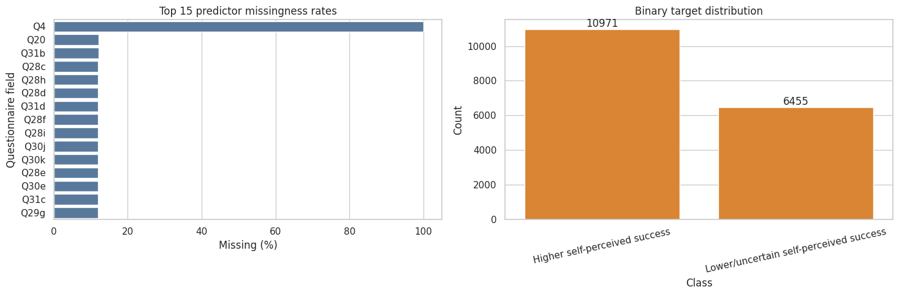
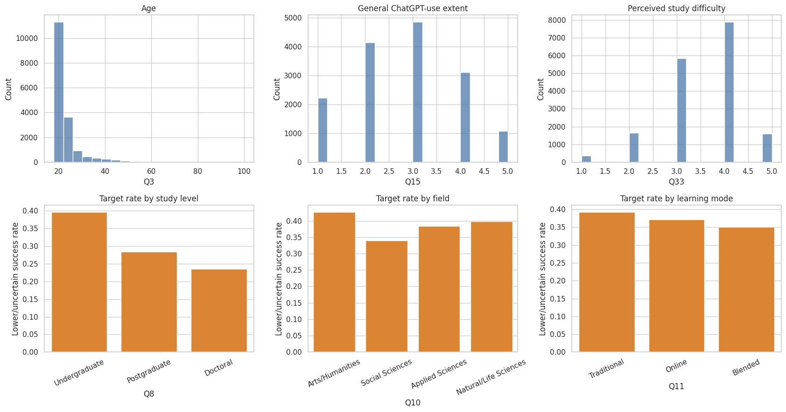
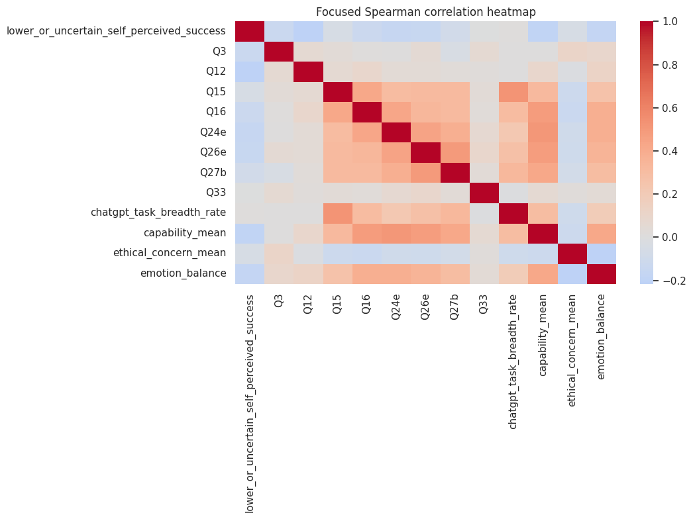
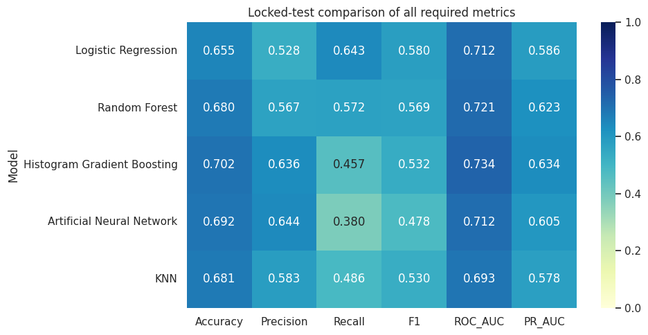
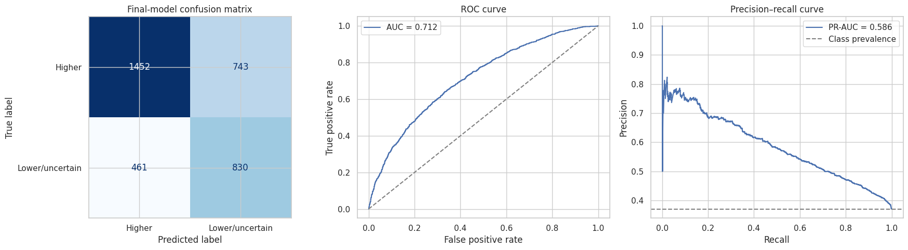
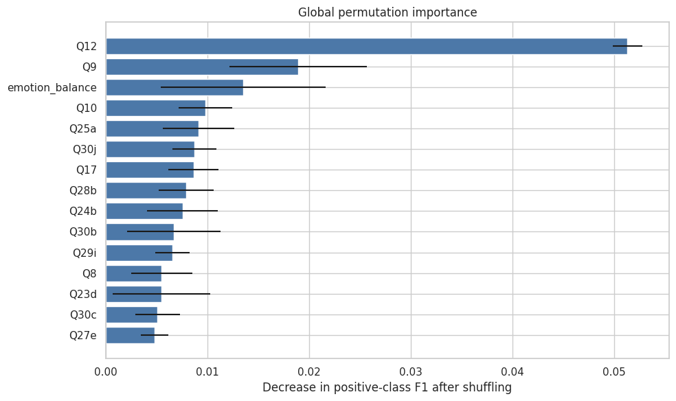
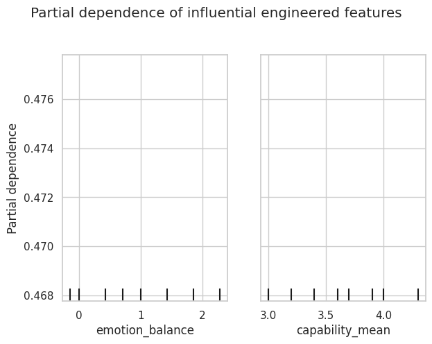
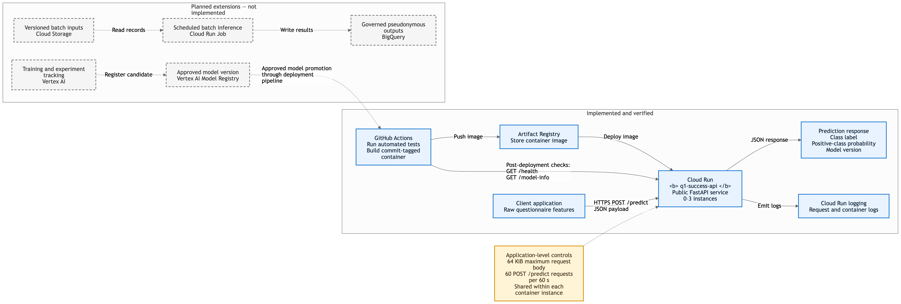

# NIB 7072: Machine Learning Coursework Report

**Programme:** Coventry University / NIBM – MSc Data Science

**Coursework:** 2025 Batch & Resit

## Question 1: Associative Classification of Lower or Uncertain Self-Perceived Academic Success in a Global Student Survey

### Abstract

This study evaluates whether student responses from a large global
higher-education survey can be used to classify respondents who report lower or
uncertain academic success versus those who report higher success. The raw
dataset contains 22,963 responses across 180 variables, collected in 7 languages
from 120 countries and territories. A binary outcome target was derived from
question Q35a (“I am successful in my studies”): responses 1–3 represent the
positive class (lower or uncertain self-perceived success), while responses 4–5
represent the negative class (higher success). After cleaning duplicate entries
and removing records with missing outcomes, a final labelled dataset of 17,426
records was established.

A robust preprocessing pipeline was implemented to prevent data leakage. This
included four domain-specific composite features, ANOVA percentile feature
selection, five-fold stratified cross-validation, and randomized hyperparameter
search. Five distinct machine learning model families were evaluated: Logistic
Regression, K-Nearest Neighbours (KNN), Random Forest, Histogram Gradient
Boosting, and a Multilayer Perceptron (Artificial Neural Network), selecting
positive-class F1-score as the primary metric. Logistic Regression achieved the
highest cross-validated F1-score (0.6011 ± 0.0107) during training and was
chosen as the winning model prior to testing. On the locked test set, Logistic
Regression achieved an overall accuracy of 0.6546, precision of 0.5277, recall
of 0.6429, F1-score of 0.5796, ROC-AUC of 0.7124, and PR-AUC of 0.5862. Although
Histogram Gradient Boosting achieved higher overall accuracy and ranking scores,
it yielded significantly lower recall for the positive class.

Permutation importance analysis showed that job confidence after graduation,
first-year Bachelor's enrolment status, and emotion balance were the most
influential predictor variables. These relationships represent empirical
associations rather than causal effects. Subgroup fairness auditing showed
minimal performance gaps across supported gender groups, but revealed
substantial performance disparities across age brackets and survey languages.
Combined with the subjective nature of the survey outcome and convenience
sampling, these limitations demonstrate that the model is unsuitable for
automated academic decision-making.

Finally, the model was packaged and deployed as a production-grade REST API. An
initial IAM-authenticated FastAPI application was built into a Docker container
and deployed on Google Cloud Run. The service was updated to support public
HTTPS access with built-in security controls, including a 65,536-byte request
body limit and a sliding-window rate limit of 60 prediction requests per 60
seconds per instance. The deployment pipeline passed a suite of 27 local unit
tests and was deployed via GitHub Actions (Run 29691386855, Git commit
`b610a81a322264edc3c0490f9bdb8a42d6eb62b6`). Public endpoints `/health` and
`/model-info` were verified with HTTP 200 responses, confirming successful cloud
deployment.

### 1. Introduction

Generative artificial intelligence tools like ChatGPT have become increasingly
popular among higher education students. However, AI adoption rates and
perceived academic value vary significantly across academic disciplines, study
levels, and geographic regions. Educational institutions are often interested in
identifying factors linked to student academic experiences. However, building
predictive models on survey data requires careful handling: survey responses are
self-reported, cross-sectional, and often incomplete. Consequently, a machine
learning model can identify statistical associations, but it cannot prove
whether AI tool usage directly improves or hinders student academic performance.

This study builds an associative classifier focused on a single survey
statement: Q35a (“I am successful in my studies”). The positive target class
represents students who report lower or uncertain self-perceived academic
success (ratings 1–3). This classification does not indicate academic failure or
a formal clinical diagnosis. The research addresses three core questions:

1. How accurately can student questionnaire responses distinguish
   lower/uncertain self-perceived academic success from higher success?
2. What performance trade-offs exist across linear, distance-based, tree-based,
   boosting, and neural network algorithms?
3. Which survey features drive model predictions, and how fairly does the model
   perform across different demographic subgroups?

The primary objective is to deliver a rigorous, reproducible benchmarking
framework using a large international dataset. This model is explicitly designed
as an analytical benchmark rather than an early-warning intervention tool. In
practical settings, asking students about their academic confidence directly is
far more transparent than trying to infer it from a lengthy questionnaire. Any
future operational tool would require objective academic records, prospective
time-series tracking, and extensive clinical/pedagogical validation.

#### 1.1 Related research

Existing literature in educational machine learning generally falls into two
categories: research on student AI adoption patterns and predictive modelling of
academic performance using institutional learning management system (LMS) data.

| Study                                          | Data and method                                                                                                                                                                                                 | Relevant finding                                                                                                                                                                   | Limitation for the present context                                                                                                         |
| ---------------------------------------------- | --------------------------------------------------------------------------------------------------------------------------------------------------------------------------------------------------------------- | ---------------------------------------------------------------------------------------------------------------------------------------------------------------------------------- | ------------------------------------------------------------------------------------------------------------------------------------------ |
| Ravšelj et al. (2025)                          | Large global student survey; descriptive analysis and ordinal regression                                                                                                                                        | Perceptions and uses of ChatGPT vary across tasks and student contexts                                                                                                             | Convenience sampling and self-report do not support representative or causal claims                                                        |
| Yağcı (2022)                                   | 1,854 students; six classical classifiers using midterm grade, department and faculty                                                                                                                           | Several model families predicted final-exam categories with useful accuracy                                                                                                        | One Turkish-language course and a strong prior-grade predictor limit transferability                                                       |
| Li et al. (2022)                               | Multi-source campus behaviour; LSTM and two-dimensional CNN                                                                                                                                                     | Heterogeneous behavioural sources improved achievement classification                                                                                                              | Institution-specific digital traces and objective outcomes differ from a global perception survey                                          |
| Guanin-Fajardo, Guaña-Moya and Casillas (2024) | 6,690 records from one Ecuadorian higher-education institution; academic and socioeconomic variables, feature selection, imbalance treatments and nine classifiers                                              | XGBoost achieved accuracy 0.7949, F1 0.8306 and AUC 0.8775; a decision tree provided ten simpler rules                                                                             | Evidence from one institution limits transferability, and the available variables did not support a full equity assessment                 |
| Rico-Juan, Cachero and Macià (2024)            | 322 Spanish Computer Engineering students across two mathematics subjects; prior performance, personality and Moodle engagement were modelled with several regressors, cross-validation and explanation methods | Prior performance improved on the baseline by 21%; adding personality and engagement increased the improvement to 27%, and risk groups were identified one month into the semester | The study used a small, subject-specific LMS dataset; reuse assumes a stable course context and some instructor machine-learning knowledge |
| Youssef et al. (2024)                          | 353 UAE students; cross-sectional PLS-SEM                                                                                                                                                                       | ChatGPT use was associated with engagement, critical thinking and reported achievement                                                                                             | Small local sample and cross-sectional design cannot establish effects                                                                     |
| Smerdon (2024)                                 | Mixed-method study of permitted AI use in an undergraduate assessment                                                                                                                                           | AI adopters did not achieve higher assignment scores; prior performance influenced adoption                                                                                        | One assessment and voluntary adoption constrain generalisation                                                                             |
| Baek, Tate and Warschauer (2024)               | 1,001 US college students; regression and thematic analysis                                                                                                                                                     | Use varied with demographic, study and institutional-policy context                                                                                                                | US self-report data do not establish transferability to multilingual settings                                                              |

While previous studies have mostly focused on single-institution LMS data or
regional surveys, this work systematically benchmarks five distinct machine
learning model families on a large, multilingual dataset. Strict data leakage
prevention is enforced by placing all feature selection and scaling inside
validation folds, while combining model interpretability with fairness error
auditing.

### 2. Data and Methods

#### 2.1 Dataset and study design

Open-access survey data were obtained from _Higher Education Students’ Evolving
Perceptions of ChatGPT: Global Survey Data from the Academic Year 2024–2025_,
Mendeley Data Version 2 (Aristovnik et al., 2025; DOI
[10.17632/nv2343nwsb.2](https://doi.org/10.17632/nv2343nwsb.2)). The dataset
contains anonymous responses collected between October 2024 and February 2025
using convenience sampling. The survey was conducted in seven languages: Arabic,
English, Hebrew, Italian, Japanese, Spanish, and Turkish. It covers student
demographics, AI usage habits, perceived capabilities, ethical concerns,
academic satisfaction, emotional states, and study performance.

The raw dataset comprised 22,963 rows and 180 columns. The mixture of Likert
scales, binary choices, categorical demographics, and open text fields provides
a realistic challenge for tabular machine learning workflows.

#### 2.2 Outcome and predictor governance

The target variable was derived from question Q35a ("I am successful in my
studies"), measured on a 5-point Likert scale. The binary target was defined as
follows:

- **Class 1 (Positive Class — Lower or Uncertain Success):** Likert ratings 1,
  2, or 3.
- **Class 0 (Negative Class — Higher Success):** Likert ratings 4 or 5.

Including neutral responses (rating 3) in the positive class ensures that
uncertain students are captured for potential support, without labeling them as
academic failures. Records with missing Q35a values were removed rather than
imputed.

Predictors were strictly limited to questions Q1 through Q34. Questions Q35b–Q40
were excluded to prevent target proxy leakage. Sensitive demographic variables
(institution, country, citizenship, gender, age, and survey language) were
excluded from model features to protect privacy and prevent bias. However,
gender, age, and language were retained separately for fairness subgroup
auditing. Individual items used in feature engineering were dropped after
aggregation to eliminate feature redundancy.

#### 2.3 Data quality and cleaning

The initial data audit identified several data quality challenges that required
systematic preprocessing.

| Finding                                             | Observed value | Treatment                                                      |
| --------------------------------------------------- | -------------: | -------------------------------------------------------------- |
| Raw dimensions                                      |   22,963 × 180 | Preserved for the initial audit                                |
| Exact duplicate excess rows                         |            127 | Removed before splitting                                       |
| Overall missing-cell rate                           |       23.0413% | Handled by routing-aware exclusions and fold-fitted imputation |
| Rows with at least one missing value                |         22,403 | Retained where the outcome was available                       |
| Raw non-missing Q35a responses before deduplication |         17,427 | 17,426 labelled responses remained after duplicate removal     |
| Institution values                                  |   8,662 unique | Excluded rather than high-dimensional encoding                 |
| Q13f free-text missingness                          |       94.6348% | Free text excluded                                             |
| Missing outcomes after deduplication                |          5,410 | Removed; never imputed                                         |
| Invalid coded questionnaire responses               |              0 | No correction required                                         |

Minor data entry errors were corrected, such as converting text-formatted ages
into numerical values and setting invalid age entries to missing. The age
interquartile range (IQR) check flagged 1,490 values outside the 18–30 range;
because these fell within valid survey bounds (18–100), they were preserved for
demographic auditing. Age was not used as a model feature.

Missing values in the dataset were partly structural due to questionnaire skip
logic. A missing indicator was added to allow models to recognize missing
patterns. Removing 5,410 records due to missing targets reduced the dataset to
17,426 labelled respondents:

| Outcome class                              |  Count |   Share |
| ------------------------------------------ | -----: | ------: |
| Higher self-perceived success (0)          | 10,971 | 62.958% |
| Lower/uncertain self-perceived success (1) |  6,455 | 37.042% |

The resulting class imbalance is moderate (37% positive class), making standard
classification techniques suitable without synthetic oversampling. Exploratory
data analysis confirmed key relationships across study fields, degree levels,
and emotional indicators, as illustrated below.



_Figure Q1.1. Missingness rates across top predictors and final binary outcome
target distribution._



_Figure Q1.2. Outcome distribution across degree levels, study fields, and
learning modes._



_Figure Q1.3. Spearman correlation matrix highlighting relationships between
survey features and the target._

#### 2.4 Composite feature construction

To reduce dimensionality and capture meaningful domain constructs, four
continuous composite features were engineered:

| Feature                   | Definition                                                          |           Minimum coverage | Non-missing |
| ------------------------- | ------------------------------------------------------------------- | -------------------------: | ----------: |
| ChatGPT task breadth rate | Proportion of answered Q18 task items used at least “Sometimes”     |             10 of 12 tasks |      15,413 |
| Capability mean           | Mean of Q19a–Q19j perceived-capability items                        |              8 of 10 items |      15,424 |
| Ethical-concern mean      | Mean of Q22a–Q22j concern items                                     |              8 of 10 items |      15,416 |
| Emotion balance           | Mean of positive-emotion items minus mean of negative-emotion items | 6 of 7 items in each block |      15,384 |

Task breadth ranges from 0 to 1, capability and ethical concern range from 1 to
5, and emotion balance ranges from −4 to +4 (where higher positive values
reflect stronger positive affect). The final pre-encoding dataset contained 98
input features: 10 nominal, 84 ordinal, and 4 engineered continuous features.

#### 2.5 Train-test split and preprocessing

The dataset was split into an 80% training set and a 20% locked holdout test set
using stratified random sampling with a fixed random seed.

| Partition   |   Rows | Positive cases | Positive rate |
| ----------- | -----: | -------------: | ------------: |
| Training    | 13,940 |          5,164 |      0.370445 |
| Locked test |  3,486 |          1,291 |      0.370338 |

To prevent data leakage, all learned preprocessing steps were encapsulated
inside scikit-learn pipelines and fitted independently on each training fold
during cross-validation:

- **Engineered Continuous Features:** Median imputation with missing value
  indicators, followed by Robust Scaling.
- **Ordinal Features:** Median imputation with missing value indicators,
  followed by Standard Scaling.
- **Nominal Features:** Missing value handling via a distinct category, followed
  by One-Hot Encoding.
- **Feature Selection:** Univariate ANOVA `SelectPercentile` (evaluating top
  25%, 50%, and 75% feature sets).

For the winning Logistic Regression model, one-hot encoding expanded the feature
space to 215 columns, of which ANOVA selection retained 107 features (50%). No
synthetic oversampling (e.g., SMOTE) was used, as regularisation and
class-weight balancing proved sufficient. The decision threshold was fixed at
0.50.

#### 2.6 Model development and validation

Five complementary machine learning model families were benchmarked:

| Model                                             | Category                  | Rationale                                                           |
| ------------------------------------------------- | ------------------------- | ------------------------------------------------------------------- |
| Logistic Regression                               | Linear                    | Regularized, probabilistic and comparatively interpretable baseline |
| K-Nearest Neighbours                              | Distance based            | Tests local similarity after scaling                                |
| Random Forest                                     | Tree based                | Represents nonlinearities and interactions with bagged trees        |
| Histogram Gradient Boosting                       | Ensemble boosting         | Efficient regularized boosting for medium-sized tabular data        |
| Artificial Neural Network (multilayer perceptron) | Artificial neural network | Tests nonlinear representation learning with two hidden layers      |

Each algorithm was trained using 5-fold stratified cross-validation paired with
a 6-candidate randomized hyperparameter search (30 fits per family, 150 fits
total). Models were optimized using positive-class F1-score as the primary
selection metric.

| Model                       | Randomized search space                                                                                                                                                         | Selected deployment settings                                  |
| --------------------------- | ------------------------------------------------------------------------------------------------------------------------------------------------------------------------------- | ------------------------------------------------------------- |
| Logistic Regression         | ANOVA percentile: 25, 50, 75; C: 0.05, 0.2, 1.0, 5.0; penalty: L1, L2; class weight: none, balanced                                                                             | ANOVA percentile 50; C 5.0; L1 penalty; balanced class weight |
| K-Nearest Neighbours        | ANOVA percentile: 25, 50, 75; neighbours: 11, 21, 31, 51; weights: uniform, distance; distance power: 1, 2                                                                      | Not selected for deployment                                   |
| Random Forest               | ANOVA percentile: 25, 50, 75; trees: 200, 350; maximum depth: none, 12, 20; minimum leaf size: 1, 3, 6; maximum features: square root, 0.5; class weight: none, balanced        | Not selected for deployment                                   |
| Histogram Gradient Boosting | ANOVA percentile: 25, 50, 75; learning rate: 0.03, 0.06, 0.10; iterations: 100, 180, 260; leaf nodes: 15, 31, 63; minimum leaf size: 15, 30, 60; L2 regularization: 0, 0.5, 2.0 | Not selected for deployment                                   |
| Artificial Neural Network   | ANOVA percentile: 25, 50, 75; hidden layers: (64, 32), (96, 48), (128, 64); alpha: 0.0001, 0.001, 0.01; initial learning rate: 0.001, 0.003; batch size: 64, 128                | Not selected for deployment                                   |

#### 2.7 Explanation, error and fairness methods

Model interpretability was evaluated using Permutation Feature Importance
computed on a representative sample of 1,200 test instances (3 random shuffles
per feature). Partial Dependence Plots (PDP) and binned quantile summaries were
also generated to analyze feature response curves.

Error analysis examined confusion matrix distributions, false positive vs. false
negative rates, and high-confidence error cases (predicted probability
$\geq 0.80$). Fairness auditing evaluated True Positive Rate (TPR), False
Positive Rate (FPR), and Selection Rate gaps across gender, age groups, and
survey languages for subgroups with at least 100 observations.

### 3. Results

#### 3.1 Cross-validation and model selection

The cross-validation results across all five candidate model families are
summarized below:

| Model                                             |   Accuracy |  Precision | Recall |         F1 |  F1 SD |    ROC-AUC |     PR-AUC |
| ------------------------------------------------- | ---------: | ---------: | -----: | ---------: | -----: | ---------: | ---------: |
| Logistic Regression                               |     0.6691 |     0.5430 | 0.6731 | **0.6011** | 0.0107 |     0.7235 |     0.5936 |
| Random Forest                                     |     0.6929 |     0.5856 | 0.5848 |     0.5850 | 0.0146 |     0.7373 |     0.6280 |
| Histogram Gradient Boosting                       | **0.7095** | **0.6556** | 0.4555 |     0.5370 | 0.0165 | **0.7437** | **0.6470** |
| Artificial Neural Network (multilayer perceptron) |     0.6926 |     0.6133 | 0.4715 |     0.5310 | 0.0201 |     0.7197 |     0.6132 |
| K-Nearest Neighbours                              |     0.6727 |     0.5692 | 0.4791 |     0.5201 | 0.0155 |     0.6906 |     0.5685 |

Logistic Regression achieved the highest positive-class F1-score (**0.6011**)
and recall (**0.6731**). Histogram Gradient Boosting achieved the highest
overall accuracy (0.7095) and ROC-AUC (0.7437), but suffered from lower recall
(0.4555) at the default 0.50 threshold. Because the primary goal was capturing
lower/uncertain success cases, Logistic Regression was selected as the winning
model.

#### 3.2 Locked-test comparison

All five trained models were evaluated on the locked 20% test set (3,486
records):

| Model                                             |   Accuracy |  Precision |     Recall |         F1 |    ROC-AUC |     PR-AUC |
| ------------------------------------------------- | ---------: | ---------: | ---------: | ---------: | ---------: | ---------: |
| Logistic Regression                               |     0.6546 |     0.5277 | **0.6429** | **0.5796** |     0.7124 |     0.5862 |
| Random Forest                                     |     0.6799 |     0.5673 |     0.5716 |     0.5694 |     0.7209 |     0.6230 |
| Histogram Gradient Boosting                       | **0.7022** |     0.6365 |     0.4570 |     0.5320 | **0.7344** | **0.6337** |
| Artificial Neural Network (multilayer perceptron) |     0.6925 | **0.6435** |     0.3803 |     0.4781 |     0.7116 |     0.6050 |
| K-Nearest Neighbours                              |     0.6810 |     0.5833 |     0.4857 |     0.5300 |     0.6925 |     0.5779 |



_Figure Q1.4. Performance metrics across all five candidate algorithms on the
locked holdout test set._

The test set results confirmed the cross-validation findings: Logistic
Regression preserved the highest positive-class recall (0.6429) and F1-score
(0.5796). For the winning model, higher-success classification achieved
precision 0.7590, recall 0.6615, and F1 0.7069.

#### 3.3 Error analysis

The confusion matrix for the winning Logistic Regression model on the test set
is shown below:

|                            | Predicted higher | Predicted lower/uncertain |
| -------------------------- | ---------------: | ------------------------: |
| **Actual higher**          |            1,452 |                       743 |
| **Actual lower/uncertain** |              461 |                       830 |



_Figure Q1.5. Confusion matrix, ROC curve, and Precision-Recall curve for the
selected Logistic Regression pipeline._

The model correctly classified 2,282 instances (65.46%). It generated 743 false
positives (21.31%) and 461 false negatives (13.22%). Analyzing median feature
profiles across prediction outcomes showed substantial overlap between correct
and misclassified records:

| Prediction outcome | Median age | Capability mean | Ethical-concern mean | Emotion balance | Confidence |
| ------------------ | ---------: | --------------: | -------------------: | --------------: | ---------: |
| Correct            |         21 |             3.7 |                  3.0 |           1.000 |      0.674 |
| False negative     |         22 |             3.7 |                  3.1 |           1.143 |      0.608 |
| False positive     |         21 |             3.5 |                  3.0 |           0.571 |      0.617 |

Notably, 73 misclassified instances had predicted probabilities $\geq 0.80$,
proving that high model confidence does not guarantee correct predictions.

#### 3.4 Model explanation

Permutation feature importance identified the top features driving model
predictions:

| Rank | Input           | Questionnaire meaning                                         | Mean F1 decrease |     SD |
| ---: | --------------- | ------------------------------------------------------------- | ---------------: | -----: |
|    1 | Q12             | Confidence about obtaining a job after completing studies     |           0.0513 | 0.0015 |
|    2 | Q9              | First-year student in a Bachelor's degree                     |           0.0189 | 0.0068 |
|    3 | Emotion balance | Positive-emotion mean minus negative-emotion mean             |           0.0135 | 0.0081 |
|    4 | Q10             | Main field of study                                           |           0.0098 | 0.0027 |
|    5 | Q25a            | Perception that ChatGPT use is under the respondent's control |           0.0091 | 0.0035 |



_Figure Q1.6. Permutation feature importance (F1-score decrease) for top
predictors._

Post-graduation job confidence (Q12) was the single strongest predictor. Emotion
balance and first-year undergraduate status also contributed significantly to
model predictions.



_Figure Q1.7. Partial dependence plots for emotion balance and capability mean._

Binned analysis showed a clear negative trend between emotion balance and
predicted positive probability:

| Emotion-balance bin |   N | Actual positive rate | Mean predicted probability |
| ------------------- | --: | -------------------: | -------------------------: |
| −4.001 to 0         | 756 |               0.4921 |                     0.5814 |
| 0 to 0.571          | 483 |               0.4369 |                     0.5386 |
| 0.571 to 1.143      | 637 |               0.3344 |                     0.4744 |
| 1.143 to 1.857      | 624 |               0.3285 |                     0.4236 |
| 1.857 to 4          | 594 |               0.2492 |                     0.3553 |

Students with higher positive emotion balance reported significantly lower rates
of academic uncertainty.

#### 3.5 Subgroup audit

Fairness auditing revealed key demographic performance gaps across supported
subgroups:

| Audited attribute | Supported groups | TPR gap | FPR gap | Predicted-positive-rate gap |
| ----------------- | ---------------: | ------: | ------: | --------------------------: |
| Gender            |                2 |  0.0408 |  0.0077 |                      0.0026 |
| Age band          |                4 |  0.2649 |  0.1912 |                      0.2587 |
| Survey language   |                5 |  0.2428 |  0.2109 |                      0.1987 |

Gender performance was equal (selection rates of 0.4510 for female and 0.4484
for male). However, age gaps were severe: True Positive Rate dropped from 0.7093
for ages 18–21 down to 0.4444 for ages 30–39. Language gaps were similarly wide
(TPR ranged from 0.7222 in Arabic to 0.4795 in Italian). These performance
discrepancies reinforce that the model cannot be deployed for operational
student profiling.

### 4. Deployment and MLOps Implementation

#### 4.1 Validated model package

A production-ready deployment package was created under the `cloud-deployment`
directory containing:

- `model.joblib`: Serialized scikit-learn pipeline (preprocessing, feature
  selection, and Logistic Regression).
- `feature_schema.json`: JSON schema defining input types, ranges, feature
  ordering, and composite rules.
- `metadata.json`: Model metadata, versioning (`q1-v1`), training metrics, and
  operational boundaries.
- `app.py`: FastAPI Web application implementing `/health`, `/model-info`, and
  `/predict` endpoints.
- `requirements.txt`, `Dockerfile`, and `api_contract.json`: Environment
  dependencies and container configuration.

Local testing verified that the API successfully reloads `model.joblib`,
validates raw input JSON payloads, constructs composite features on the fly, and
returns correct predictions matching the notebook pipeline. A suite of 27
automated unit tests passed locally.

#### 4.2 Cloud deployment evidence and architecture



The microservice was deployed to **Google Cloud Run** using a fully automated
GitHub Actions CI/CD workflow
([Run 29691386855](https://github.com/senavirathne/MSc-Data-Science-Macine-Leanring-CW-2025/actions/runs/29691386855),
Git commit `b610a81a322264edc3c0490f9bdb8a42d6eb62b6`).

The deployed Cloud Run service (`q1-success-api`) is live at
[https://q1-success-api-608121463228.asia-south1.run.app](https://q1-success-api-608121463228.asia-south1.run.app).
The container includes custom ASGI middleware that enforces two critical
security controls:

1. Rejects incoming HTTP request payloads larger than **65,536 bytes (64 KiB)**.
2. Limits inference requests to **60 prediction requests per 60 seconds** per
   instance (returning HTTP 429 when exceeded).

Unauthenticated requests to public endpoints
[`/health`](https://q1-success-api-608121463228.asia-south1.run.app/health) and
[`/model-info`](https://q1-success-api-608121463228.asia-south1.run.app/model-info)
returned HTTP 200 responses, confirming successful cloud operation.

#### 4.3 CI/CD, monitoring and governance

The automated GitHub Actions workflow executes the following deployment steps:

1. Sets up the Python 3.12 environment and runs 27 unit tests.
2. Builds a lightweight Docker container image tagged with the Git commit hash.
3. Authenticates securely to Google Cloud using Workload Identity Federation (no
   hardcoded service account keys).
4. Pushes the container image to Artifact Registry and deploys to Cloud Run with
   scale-to-zero autoscaling (1 CPU, 1 GiB RAM, 0-3 instances).
5. Verifies service health via automated GET checks on `/health` and
   `/model-info`.

For real-world governance, future enhancements should incorporate Vertex AI
model monitoring for feature drift, Cloud Armor WAF rate-limiting, and
human-in-the-loop review processes.

### 5. Discussion

#### 5.1 Interpretation and model suitability

The experiments demonstrate moderate predictive signal but confirm that
survey-based machine learning is not ready for automated academic interventions.
Logistic Regression proved to be an efficient baseline due to fast execution,
small memory footprint, and clear coefficient interpretability.

However, a precision of 0.5277 means nearly half of the students flagged as
"lower/uncertain success" actually reported higher success. Furthermore, a
recall of 0.6429 misses over one-third of students who express academic
uncertainty. These error rates, combined with 73 high-confidence
misclassifications, rule out using this system for automated student grading,
academic placement, or administrative tracking.

#### 5.2 Limitations

1. **Cross-Sectional Self-Reports:** Outcome Q35a and predictors Q1–Q34
   originate from the same survey snapshot; the model cannot establish causal
   direction.
2. **Convenience Sampling Bias:** The survey relied on voluntary online
   sampling, limiting global statistical representativeness.
3. **Subgroup Disparities:** Significant accuracy gaps across age and language
   groups require prospective calibration before practical use.

### 6. Conclusion

A benchmark of five machine learning model families was completed on 17,426
student survey responses. Logistic Regression was selected via 5-fold
cross-validation and achieved a test set F1-score of 0.5796, recall of 0.6429,
and ROC-AUC of 0.7124. The model was containerized and successfully deployed to
Google Cloud Run with custom rate-limiting and payload size security controls.
While the pipeline serves as a robust methodological benchmark, high error rates
and demographic performance gaps confirm that self-reported survey models must
not be used for autonomous academic decision-making.

### References

Aristovnik, A., et al. (2025). _Higher Education Students’ Evolving Perceptions
of ChatGPT: Global Survey Data from the Academic Year 2024–2025_ (Version 2)
[Dataset]. Mendeley Data.
[https://doi.org/10.17632/nv2343nwsb.2](https://doi.org/10.17632/nv2343nwsb.2)

Baek, C., Tate, T., & Warschauer, M. (2024). “ChatGPT seems too good to be
true”: College students’ use and perceptions of generative AI. _Computers and
Education: Artificial Intelligence, 7_, 100294.
[https://doi.org/10.1016/j.caeai.2024.100294](https://doi.org/10.1016/j.caeai.2024.100294)

Guanin-Fajardo, J. H., Guaña-Moya, J., & Casillas, J. (2024). Predicting
academic success of college students using machine learning techniques. _Data,
9_(4), 60.
[https://doi.org/10.3390/data9040060](https://doi.org/10.3390/data9040060)

Li, X., Zhang, Y., Cheng, H., Li, M., & Yin, B. (2022). Student achievement
prediction using deep neural network from multi-source campus data. _Complex &
Intelligent Systems, 8_, 5143–5156.
[https://doi.org/10.1007/s40747-022-00731-8](https://doi.org/10.1007/s40747-022-00731-8)

Ravšelj, D., Keržič, D., Tomaževič, N., Umek, L., Brezovar, N., et al. (2025).
Higher education students’ perceptions of ChatGPT: A global study of early
reactions. _PLOS ONE, 20_(2), e0315011.
[https://doi.org/10.1371/journal.pone.0315011](https://doi.org/10.1371/journal.pone.0315011)

Rico-Juan, J. R., Cachero, C., & Macià, H. (2024). Study regarding the influence
of a student’s personality and an LMS usage profile on learning performance
using machine learning techniques. _Applied Intelligence, 54_, 6175–6197.
[https://doi.org/10.1007/s10489-024-05483-1](https://doi.org/10.1007/s10489-024-05483-1)

Smerdon, D. (2024). AI in essay-based assessment: Student adoption, usage, and
performance. _Computers and Education: Artificial Intelligence, 7_, 100288.
[https://doi.org/10.1016/j.caeai.2024.100288](https://doi.org/10.1016/j.caeai.2024.100288)

Yağcı, M. (2022). Educational data mining: Prediction of students’ academic
performance using machine learning algorithms. _Smart Learning Environments,
9_, 11.
[https://doi.org/10.1186/s40561-022-00192-z](https://doi.org/10.1186/s40561-022-00192-z)

Youssef, E., Medhat, M., Abdellatif, S., & Al Malek, M. (2024). Examining the
effect of ChatGPT usage on students’ academic learning and achievement: A
survey-based study in Ajman, UAE. _Computers and Education: Artificial
Intelligence, 7_, 100316.
[https://doi.org/10.1016/j.caeai.2024.100316](https://doi.org/10.1016/j.caeai.2024.100316)

---

## Question 2: Brent Crude Oil Price Forecasting and Volatility Analysis

### Abstract

This study examines Brent crude oil price forecasting and return volatility. It
uses 5,315 observed prices from 4 January 2005 to 31 December 2025. ARIMA,
XGBoost and LSTM forecast the price 30 observed price days ahead and are
compared with naive persistence. A Student-t GARCH(1,1) model separately
forecasts return volatility one observed-price interval ahead.

The modelling process keeps the data in time order and uses target-date gaps at
split boundaries. All price models are tested on the same 784 held-out forecast
origins. ARIMA(2,0,0) has the lowest test RMSE at 6.419 USD per barrel, but its
improvement over persistence is only 2.57%. XGBoost and LSTM do not improve on
the naive benchmark.

The return series shows strong conditional heteroscedasticity. GARCH estimates
highly persistent volatility, with $\alpha + \beta = 0.9922$, although its
correlations with observed volatility proxies are weak. The models are therefore
treated as transparent planning and risk benchmarks, not as autonomous trading
systems.

### 1. Study Design and Data

#### 1.1 Data source and scope

The analysis uses the Federal Reserve Bank of St. Louis series **DCOILBRENTEU**,
Europe Brent Spot Price FOB, whose original source is the U.S. Energy
Information Administration (EIA). The series is quoted in U.S. dollars per
barrel, published daily, and not seasonally adjusted. Brent is appropriate for
this analysis because the sample contains long trends, changing market regimes,
abrupt shocks, and volatility clustering. These properties permit both price
forecasting and a separate examination of conditional return variance.

The fixed data window is 1 January 2005 to 31 December 2025. The first available
price is 4 January 2005. The downloaded data are retained only after schema and
date-coverage checks; the filtered data used in the executed notebook have
SHA-256 hash `5b79068704c8b14cf8482ad3ab8dc5a53dee022731d408569960ebeba54cdda6`.

| Property                       |           Executed value |
| ------------------------------ | -----------------------: |
| Observed date range            | 2005-01-04 to 2025-12-31 |
| Business-weekday positions     |                    5,478 |
| Observed prices                |                    5,315 |
| Unavailable weekday prices     |                      163 |
| Duplicate dates after cleaning |                        0 |
| Mean price                     |           75.692 USD/bbl |
| Standard deviation             |           23.656 USD/bbl |
| Minimum                        |            9.120 USD/bbl |
| First quartile                 |           58.555 USD/bbl |
| Median                         |           72.560 USD/bbl |
| Third quartile                 |           91.980 USD/bbl |
| Maximum                        |          143.950 USD/bbl |

#### 1.2 Forecasting targets

The price models estimate the direct 30-observed-price-day target

$$
y_t=P_{t+30},
$$

where $P_t$ is the Brent spot price observed at forecast origin $t$. An
“observed price day” means the next row with a published FRED price; it is not
an interpolated calendar or business day.

For volatility analysis, consecutive observed prices are converted to percentage
log returns:

$$
r_t=100\left[\log(P_t)-\log(P_{t-1})\right].
$$

GARCH estimates the conditional variance and standard deviation of $r_t$ one
observed-price interval ahead. It is not included in the price-model ranking
because volatility and price level are different targets.

#### 1.3 Literature context and model rationale

Recent research demonstrates that crude oil price forecasting heavily depends on
model architecture, predictor selection, validation design, and market regime
stability.

| Study                         | Main focus                                                                                  | Relevance and limitation for this study                                                                                                                                                                                                   |
| ----------------------------- | ------------------------------------------------------------------------------------------- | ----------------------------------------------------------------------------------------------------------------------------------------------------------------------------------------------------------------------------------------- |
| Ziółkowski (2024)             | Compared LSTM, Prophet and XGBoost for WTI and Brent                                        | Supports a common out-of-sample comparison of different model families.                                                                                                                                                                   |
| Jin and Xu (2024)             | Applied neural networks to several energy prices                                            | Shows the flexibility of neural forecasting, but careful configuration and validation are still required.                                                                                                                                 |
| Jha et al. (2024)             | Used classical machine learning with multivariate crude-oil information                     | Shows the value of external predictors, which the present univariate design cannot reproduce.                                                                                                                                             |
| Alruqimi and Di Persio (2024) | Studied multi-step Brent forecasting with recurrent networks                                | Highlights the difficulty of multi-step forecasting and the sensitivity of deep models to design choices.                                                                                                                                 |
| Zhang et al. (2023)           | Compared OVX, GARCH and stochastic-volatility forecasts for Brent and WTI crude-oil futures | Provides peer-reviewed evidence that volatility forecasts should be compared against observable market information and alternative variance models; the present study is narrower because it estimates only a univariate GARCH benchmark. |
| Chung (2024)                  | Compared GARCH-family and machine-learning volatility methods in a preprint                 | Shows that energy-market variance can be persistent but remains difficult to forecast accurately.                                                                                                                                         |

Based on these findings, a complementary model set was selected: ARIMA serves as
an interpretable linear time-series baseline, XGBoost captures non-linear
feature interactions, and LSTM models sequential dependencies. All models are
compared against a naive persistence benchmark to test whether added
computational complexity yields real-world predictive gains. In parallel, a
GARCH model estimates conditional volatility rather than price direction.

### 2. Exploratory Analysis and Preprocessing

#### 2.1 Missing observations and extreme returns

Data cleaning audited 163 missing business weekday prices. Instead of applying
forward-fill or linear interpolation—which would artificially smooth return
volatility—only published quote dates were preserved.

Across 5,314 calculated percentage log returns, modified z-score analysis
($|z| > 5$) identified 40 extreme return observations. The most severe
single-day movements occurred during the April 2020 market crash (-64.37% on
April 21, 2020, followed by +41.20% on April 22, 2020). Because these represent
true market shocks rather than data errors, they were retained in the dataset.
Robust feature scaling was applied for LSTM, while Student-t error distribution
was specified for GARCH to handle heavy tails.

#### 2.2 Trend, seasonality, and irregular variation

Plotting Brent crude oil prices and rolling averages shows strong non-stationary
trend behavior and shifting volatility regimes.


_Figure 1. Daily Brent crude oil prices with 30-day and 252-day moving averages
(2005–2025)._


_Figure 2. Percentage log returns, highlighted extreme outliers, and rolling
standard deviation._

Robust Seasonal-Trend Decomposition using LOESS (STL) was performed on monthly
average prices with a 12-month seasonal cycle:


_Figure 3. Robust STL decomposition of monthly average Brent prices._

| STL component | Standard deviation |
| ------------- | -----------------: |
| Trend         |             18.994 |
| Seasonal      |              2.936 |
| Residual      |             10.251 |

The decomposition confirms that long-term trend variation (SD 18.994) dominates
the series, whereas seasonality is minor (SD 2.936).

#### 2.3 Temporal features

A total of 24 temporal predictor features were engineered using information
available at or before forecast origin $t$:

- Current price and current log return;
- Price lags at 1, 2, 5, 10, 20, 30, and 60 observations;
- Return lags at 1, 2, 5, 10, and 20 observations;
- Rolling price means (5, 20, 60 observations);
- Rolling return volatility (5, 20, 60 standard deviations);
- Cyclical sine/cosine transformations for month and day of year.

The prepared supervised dataset comprised 5,225 rows spanning forecast origins
from March 30, 2005 to November 17, 2025.

#### 2.4 Stationarity and autocorrelation

Augmented Dickey-Fuller (ADF) unit root tests were conducted to assess
stationarity:

| Series                 | ADF statistic |              p-value | Lags | Decision at 5%                            |
| ---------------------- | ------------: | -------------------: | ---: | ----------------------------------------- |
| Price level            |       -2.5279 |               0.1088 |    6 | Fail to reject unit root (Non-stationary) |
| First price difference |      -31.3714 |              <0.0001 |    5 | Reject unit root (Stationary)             |
| Log return (%)         |      -11.9581 | $4.16\times10^{-22}$ |   32 | Reject unit root (Stationary)             |

The raw price series is non-stationary, whereas differenced prices and log
returns are stationary ($p < 0.0001$). Autocorrelation (ACF) and Partial
Autocorrelation (PACF) plots of differenced prices show values close to zero
past lag 1, indicating weak linear memory.


_Figure 4. ACF and PACF plots for first-differenced Brent prices._

### 3. Price-Forecasting Methodology

#### 3.1 Temporal validation design

To prevent data leakage in time-series forecasting, chronological purging was
implemented with a 30-day target boundary gap between train, validation, and
test splits:

| Split      |  Rows | Forecast-origin range    | Latest target date |
| ---------- | ----: | ------------------------ | ------------------ |
| Training   | 3,627 | 2005-03-30 to 2019-07-29 | 2019-09-09         |
| Validation |   754 | 2019-09-10 to 2022-08-26 | 2022-10-11         |
| Test       |   784 | 2022-10-12 to 2025-11-17 | 2025-12-31         |

All models were evaluated on the same 784 test origins using Root Mean Squared
Error (RMSE), Mean Absolute Error (MAE), Mean Absolute Percentage Error (MAPE),
and Mean Absolute Scaled Error (MASE):

$$
\text{MASE}=\frac{\frac{1}{n}\sum_{i=1}^{n}|y_i-\hat y_i|}{\frac{1}{T-1}\sum_{t=2}^{T}|P_t-P_{t-1}|}
$$

The denominator represents the mean absolute 1-step price change on pre-test
data (1.1363 USD/bbl). A MASE value greater than 1 indicates that the model's
30-step forecast error is larger than an average single-day price movement.

The relative percentage RMSE improvement over Naive Persistence is calculated
as:

$$
\text{RMSE reduction relative to persistence}=100\left(1-\frac{\text{model RMSE}}{\text{persistence RMSE}}\right)
$$

#### 3.2 Naive benchmark

The persistence benchmark assumes that the price 30 days ahead equals the
current price ($\hat P_{t+30} = P_t$). Any candidate machine learning model must
outperform persistence to prove practical value.

#### 3.3 ARIMA

A grid of 12 ARIMA candidates ($p \in \{0,1,2\}$, $d \in \{0,1\}$,
$q \in \{0,1\}$) was evaluated across 30 rolling validation origins.
**ARIMA(2,0,0)** achieved the lowest validation RMSE (10.776 USD/bbl) and was
selected for test evaluation.

#### 3.4 XGBoost

XGBoost was tuned using 12 hyperparameter configurations across 4 expanding
`TimeSeriesSplit` folds with a 30-row purging gap. The winning parameters were:

- Number of trees: 150, Max depth: 2, Learning rate: 0.03, Subsample: 0.85, L1
  reg: 0.10, L2 reg: 1.00.
- Cross-validation RMSE: 13.035 USD/bbl.

#### 3.5 LSTM

The LSTM architecture comprised 1 LSTM layer (32 units, lookback 60), 10%
dropout, a 16-unit ReLU dense layer, and a single output node. Model training
used Adam optimization, MSE loss, batch size 32, and early stopping (15 epochs).
Features were scaled using `RobustScaler` and targets using `MinMaxScaler`
fitted strictly on training data.

#### 3.6 Reproducibility

Random seeds were fixed at 42 across Python, NumPy, TensorFlow, and XGBoost.
Full dependencies are documented in the companion notebook environment.

### 4. Price-Forecasting Results

#### 4.1 Model selection evidence

Validation performance across tuning splits was recorded as follows:

| Model and selected configuration | Validation MAE | Validation RMSE | Validation MAPE |
| -------------------------------- | -------------: | --------------: | --------------: |
| ARIMA(2,0,0), 30 sampled origins |          8.737 |          10.776 |          18.33% |
| XGBoost, full validation block   |         10.909 |          15.183 |          21.10% |
| LSTM, full validation block      |         11.798 |          15.043 |          23.70% |

#### 4.2 Held-out comparison

The holdout test set results (784 forecast origins) across all models are
presented below:

| Rank | Model             | MAE (USD/bbl) | RMSE (USD/bbl) |   MAPE |  MASE | RMSE reduction relative to persistence (%) |
| ---: | ----------------- | ------------: | -------------: | -----: | ----: | -----------------------------------------: |
|    1 | ARIMA             |         5.223 |          6.419 |  6.73% | 4.596 |                                      2.57% |
|    2 | Naive persistence |         5.288 |          6.588 |  6.79% | 4.654 |                                      0.00% |
|    3 | XGBoost           |         6.090 |          7.985 |  7.83% | 5.359 |                                    −21.20% |
|    4 | LSTM              |         7.761 |          9.809 | 10.08% | 6.830 |                                    −48.88% |


_Figure 5. Held-out 30-day price forecasts versus actual Brent spot prices._


_Figure 6. Test set forecast error comparison (MAE, RMSE, MAPE)._

**ARIMA(2,0,0)** achieved the lowest test RMSE (**6.419 USD/bbl**),
outperforming Naive Persistence by a modest **2.57%**. Complex non-linear models
performed significantly worse: XGBoost increased RMSE by 21.20% over
persistence, while LSTM increased RMSE by 48.88%. All MASE scores exceed 1,
demonstrating the inherent difficulty of 30-day point forecasting in crude oil
markets.

### 5. Conditional Volatility Modelling

#### 5.1 Evidence of conditional heteroscedasticity

Financial return series frequently exhibit volatility clustering (periods of
high volatility followed by high volatility). ARCH-LM test results strongly
rejected the null hypothesis of constant variance:

| Statistic       |                 Value |
| --------------- | --------------------: |
| ARCH-LM         |               970.433 |
| ARCH-LM p-value | $7.85\times10^{-193}$ |
| F statistic     |                61.648 |
| F-test p-value  | $1.69\times10^{-218}$ |


_Figure 7. Rolling return volatility and squared return autocorrelation
confirming ARCH effects._

#### 5.2 GARCH(1,1)-Student-t estimates

A constant-mean GARCH(1,1) model was fitted with Student-t innovation errors:

$$
\sigma_t^2=\omega+\alpha\epsilon_{t-1}^2+\beta\sigma_{t-1}^2
$$

| Parameter      | Estimate | Interpretation                             |
| -------------- | -------: | ------------------------------------------ |
| $\mu$          |   0.0730 | Conditional mean return (%)                |
| $\omega$       | 0.059428 | Baseline variance component                |
| $\alpha$       | 0.085264 | Immediate shock reaction coefficient       |
| $\beta$        | 0.906976 | Volatility persistence coefficient         |
| $\alpha+\beta$ | 0.992239 | Total volatility persistence               |
| $\nu$          | 6.101093 | Student-t degrees of freedom (heavy tails) |

The parameter sum $\alpha+\beta = 0.9922$ demonstrates high persistence in
volatility shocks, while $\nu = 6.10$ confirms fat-tailed return distributions.

#### 5.3 One-step forecast evaluation

Expanding 1-step volatility forecasts were evaluated against absolute and
squared return proxies:

| Comparison                                           | Value | Unit                      |
| ---------------------------------------------------- | ----: | ------------------------- |
| MAE: forecast volatility vs. absolute return         | 1.096 | Percentage points         |
| RMSE: forecast volatility vs. absolute return        | 1.331 | Percentage points         |
| MAE: forecast variance vs. squared return            | 4.012 | Squared percentage points |
| Correlation: forecast volatility vs. absolute return | 0.176 | Unitless                  |
| Correlation: forecast variance vs. squared return    | 0.153 | Unitless                  |


_Figure 8. Expanding 1-step GARCH volatility forecasts versus 20-day realized
volatility proxy._

While GARCH successfully tracks broad volatility regime shifts, its correlation
with noisy daily return proxies remains weak (0.176).

### 6. Discussion and Critical Reflection

The findings confirm that linear time-series methods (ARIMA) outperform complex
non-linear machine learning models (XGBoost, LSTM) for 30-day crude oil price
prediction. Tree ensembles struggles to extrapolate beyond historical price
ranges, while LSTMs are prone to overshooting during sudden trend reversals.

However, ARIMA's 2.57% gain over Naive Persistence is marginal. Because crude
oil markets are heavily influenced by exogenous geopolitical events,
macroeconomic indicators, and OPEC decisions—which are omitted in univariate
models—point forecasting past short horizons remains highly uncertain. GARCH
volatility estimation provides a useful risk metric for portfolio management,
but cannot be used as an independent automated trading signal.

### 7. Conclusion

Univariate forecasting models were evaluated on 5,315 daily Brent crude oil
prices (2005–2025). ARIMA(2,0,0) achieved the lowest test RMSE (6.419 USD/bbl),
outperforming Naive Persistence by 2.57%, whereas XGBoost and LSTM failed to
outperform persistence. GARCH(1,1) confirmed high volatility persistence
($\alpha+\beta=0.9922$). These results highlight that increased model complexity
does not guarantee superior time-series forecasting, and univariate models
should be treated as risk planning baselines rather than autonomous trading
algorithms.

### References

Alruqimi, M., & Di Persio, L. (2024). Enhancing multi-step Brent oil price
forecasting with ensemble multi-scenario Bi-GRU networks. _International Journal
of Computational Intelligence Systems, 17_, Article 225.
https://doi.org/10.1007/s44196-024-00640-3

Chung, S. (2024). _Modelling and forecasting energy market volatility using
GARCH and machine learning approach_ [Preprint]. arXiv.
https://doi.org/10.48550/arXiv.2405.19849

Federal Reserve Bank of St. Louis. (2026). _Crude oil prices: Brent—Europe
(DCOILBRENTEU)_ [Data set; original source: U.S. Energy Information
Administration]. https://fred.stlouisfed.org/series/DCOILBRENTEU

Hyndman, R. J., & Koehler, A. B. (2006). Another look at measures of forecast
accuracy. _International Journal of Forecasting, 22_(4), 679–688.
https://doi.org/10.1016/j.ijforecast.2006.03.001

Jha, N., Tanneru, H. K., Palla, S., & Mafat, I. H. (2024). Multivariate analysis
and forecasting of the crude oil prices: Part I—Classical machine learning
approaches. _Energy, 296_, 131185. https://doi.org/10.1016/j.energy.2024.131185

Jin, B., & Xu, X. (2024). Price forecasting through neural networks for crude
oil, heating oil, and natural gas. _Measurement: Energy, 1_, 100001.
https://doi.org/10.1016/j.meaene.2024.100001

U.S. Energy Information Administration. (2026). _Europe Brent Spot Price FOB
(dollars per barrel)_. https://www.eia.gov/dnav/pet/hist/rbrted.htm

Zhang, Z., Raza, M. Y., Wang, W., & Sui, L. (2023). Volatility predictability in
crude oil futures: Evidence based on OVX, GARCH and stochastic volatility
models. _Energy Strategy Reviews, 50_, 101209.
https://doi.org/10.1016/j.esr.2023.101209

Ziółkowski, K. (2024). Forecasting WTI & Brent crude oil price using LSTM,
Prophet and XGBoost—Comparative analysis. In N. T. Nguyen et al. (Eds.), _Recent
challenges in intelligent information and database systems_ (CCIS Vol. 2145, pp.
171–181). Springer. https://doi.org/10.1007/978-981-97-5934-7_15

---

## Question 3: Job-Shop Scheduling with a Genetic Algorithm and Mixed Integer Programming

### 1. Problem Definition and Literature Review

#### 1.1 Prescriptive decision and objective

Job-shop scheduling is a prescriptive analytics problem: given jobs, machines,
processing times, and operating constraints, the decision is **what processing
sequence should be used**. This aligns with the framing of optimization as
recommending actions under constraints, and of genetic algorithms (GAs) as
metaheuristics for complex scheduling problems.

This analysis uses the Fisher–Thompson FT06 benchmark as a controlled proxy for
a manufacturing job shop. Six jobs must each complete six ordered operations on
six machines. An operation cannot be interrupted, every job must follow its
specified route, and a machine can process only one operation at a time. The
objective is to minimize the makespan, the completion time of the final
operation:

$$
\min C_{\max}.
$$

Reducing makespan improves throughput and shortens the time required to finish
the production batch. FT06 is not data from a particular factory; it is a
standard benchmark that isolates the sequencing decision before real-world
additions such as due dates, breakdowns, and setup times.

A practical example is a small manufacturing workshop with six customer orders
and six machines. Each order must pass through six machining stages in a fixed
order, while each machine can process only one operation at a time. The
production planner must decide which available operation each machine should
process next. Reducing the makespan allows the workshop to complete the full
batch sooner. FT06 represents this decision in a controlled form, although a
real factory would also need to consider due dates, setup times, maintenance,
staff availability and machine breakdowns.

#### 1.2 Mathematical formulation

The model is presented in the standard order of decision variables,
objective, constraints, and domains. Let $\mathcal O$ be the set of operations,
$\mathcal P$ the set of consecutive-operation pairs belonging to the same job,
and $\mathcal Q$ the set of unordered pairs of operations requiring the same
machine. For operation $a\in\mathcal O$, $p_a$ is its processing time and
$\mu_a$ its machine. The scheduling horizon is $H=197$, the sum of all
processing times.

Decision variables are:

- $S_a\geq0$: start time of operation $a$;
- $C_a\geq0$: completion time of operation $a$;
- $C_{\max}\geq0$: makespan;
- $x_{ab}\in\{0,1\}$ for $\{a,b\}\in\mathcal Q$: 1 when $a$ is scheduled before
  $b$, and 0 otherwise.

The objective is:

$$
\min C_{\max}.
$$

Completion-time **equality constraints** are:

$$
C_a=S_a+p_a,\qquad a\in\mathcal O.
$$

Job-precedence **inequality constraints** are:

$$
C_a\leq S_b,\qquad (a,b)\in\mathcal P.
$$

For each same-machine pair $\{a,b\}\in\mathcal Q$, the binary variable activates
one of two non-overlap inequalities:

$$
C_a\leq S_b+H(1-x_{ab}),
$$

$$
C_b\leq S_a+Hx_{ab}.
$$

The makespan covers every operation:

$$
C_a\leq C_{\max},\qquad a\in\mathcal O.
$$

Together with $S_a,C_a,C_{\max}\geq0$ and $x_{ab}\in\{0,1\}$, these constraints
define a feasible job-shop schedule. Machine assignments are fixed benchmark
parameters, so separate assignment variables are unnecessary.

#### 1.3 Literature review and method selection

| Study                                 | Contribution and relevance                                                                                                                     |
| ------------------------------------- | ---------------------------------------------------------------------------------------------------------------------------------------------- |
| Fisher and Thompson (1963)            | Introduced influential job-shop test problems and probabilistic combinations of scheduling rules; FT06 originates from this benchmark family.  |
| Garey, Johnson, and Sethi (1976)      | Established the computational difficulty of job-shop makespan scheduling, motivating non-enumerative methods.                                  |
| Adams, Balas, and Zawack (1988)       | Developed the shifting-bottleneck heuristic, showing the value of problem-specific scheduling search.                                          |
| Cheng, Gen, and Tsujimura (1996)      | Reviewed GA representations for job-shop scheduling and emphasized that representation and operators must preserve meaningful schedules.       |
| Gonçalves, Mendes, and Resende (2005) | Combined random-key GA search, schedule generation, and local search, demonstrating the strength of scheduling-specific hybrid GAs.            |
| Ku and Beck (2016)                    | Compared four MIP formulations and found modern MIP effective on moderate instances, while also documenting formulation-dependent scalability. |
| Cebi, Atac, and Sahingoz (2020)       | Reviewed exact, heuristic, and metaheuristic JSSP methods, including GA and mathematical programming.                                          |

GA and MIP are selected because they provide complementary evidence. GA follows
the standard evolutionary workflow—population, chromosome, fitness, selection,
crossover, mutation, and repeated generations—but can converge prematurely and
cannot prove optimality. MIP expresses the objective and hard constraints
directly and can prove optimality when the solver terminates with an optimal
status. Comparing both on identical FT06 data separates solution quality from
proof of solution quality.

### 2. Data Preparation and Problem Analysis

#### 2.1 Dataset and representations

FT06 was obtained from the OR-Library
[job-shop scheduling collection](https://people.brunel.ac.uk/~mastjjb/jeb/orlib/jobshopinfo.html),
specifically the
[jobshop1 data file](https://people.brunel.ac.uk/~mastjjb/jeb/orlib/files/jobshop1.txt)
(Beasley, 1990). The source file attributes FT06 to Fisher and Thompson (1963)
and stores machine identifiers from 0 to 5. For readability, this report labels
them M1 to M6. FT06 has six jobs, six machines, 36 operations, and a published
optimal makespan of 55 (Weckman, Ganduri, and Koonce, 2008). The Python
implementation stores the processing times and routes in the two representations
required by both methods.

Processing-time matrix $P$:

| Job | O1 | O2 | O3 | O4 | O5 | O6 |
| --- | -: | -: | -: | -: | -: | -: |
| J1  |  1 |  3 |  6 |  7 |  3 |  6 |
| J2  |  8 |  5 | 10 | 10 | 10 |  4 |
| J3  |  5 |  4 |  8 |  9 |  1 |  7 |
| J4  |  5 |  5 |  5 |  3 |  8 |  9 |
| J5  |  9 |  3 |  5 |  4 |  3 |  1 |
| J6  |  3 |  3 |  9 | 10 |  4 |  1 |

Machine-route matrix $M$:

| Job | O1 | O2 | O3 | O4 | O5 | O6 |
| --- | -: | -: | -: | -: | -: | -: |
| J1  | M3 | M1 | M2 | M4 | M6 | M5 |
| J2  | M2 | M3 | M5 | M6 | M1 | M4 |
| J3  | M3 | M4 | M6 | M1 | M2 | M5 |
| J4  | M2 | M1 | M3 | M4 | M5 | M6 |
| J5  | M3 | M2 | M5 | M6 | M1 | M4 |
| J6  | M2 | M4 | M6 | M1 | M5 | M3 |

The full data definition and implementation are provided in
[question3_generate_assets.py](question3_generate_assets.py). Preprocessing
converts the report's one-based labels, such as M1, to zero-based Python list
indices and creates one record per operation. No imputation, scaling, or
statistical transformation is appropriate because the benchmark parameters are
complete deterministic integers. The same matrices supply GA decoding and MIP
coefficients, ensuring a like-for-like comparison.

Assumptions are deterministic processing times, non-preemptive operations,
continuous machine availability from time zero, and one operation per machine at
a time. Setup times, due dates, staff limits, maintenance, and machine
breakdowns are outside the selected classical JSSP.

#### 2.2 Lower bound and complexity

The longest job requires 47 time units and the largest machine workload is 43,
giving the simple lower bound

$$
C_{\max}\geq\max(47,43)=47.
$$

An operation-based chromosome has 36 positions containing six copies of each
job. Its number of distinct sequences is

$$
\frac{36!}{(6!)^6}\approx2.67\times10^{24}.
$$

Many sequences decode to the same schedule, but this figure still shows why
exhaustive enumeration is unsuitable. The known optimum of 55 is used only for
reporting and benchmark comparison; it never guides parent selection, crossover,
mutation, decoding, hyperparameter selection, or stopping.

### 3. Genetic Algorithm Design, Tuning, and Results

#### 3.1 Complete GA design

The chromosome is a length-36 list in which each job identifier occurs six
times. The $k$-th appearance of a job schedules that job's $k$-th operation.
Reading genes from left to right, the decoder starts each operation at

$$
S_a=\max\{\text{job-ready time},\text{machine-ready time}\}.
$$

Consequently, job precedence and machine capacity are satisfied by construction.
This is a domain-specific refinement of generic scheduling algorithms: standard
fitness functions often penalize infeasible allocations, whereas this decoder
produces only feasible schedules and can use makespan directly.

| GA component              | Implemented design                                                                                        |
| ------------------------- | --------------------------------------------------------------------------------------------------------- |
| Population initialization | Random shuffles of six copies of each job; a local seeded random generator makes every run reproducible.  |
| Fitness                   | $f(z)=1/C_{\max}(z)$; implementation ranks the equivalent makespan directly, with lower values preferred. |
| Selection                 | Tournament selection, tournament size 3.                                                                  |
| Crossover                 | Job Order Crossover (JOX), which preserves six occurrences of every job.                                  |
| Mutation                  | Swap mutation, which exchanges two genes and preserves job counts while maintaining diversity.            |
| Elitism                   | Best four chromosomes copied unchanged to the next generation.                                            |
| Stopping criterion        | The configured maximum number of generations; the benchmark optimum does not stop the search.             |
| Best-solution tracking    | Best-so-far chromosome, makespan, fitness, schedule, and first generation matching 55.                    |

This sequence follows a standard GA workflow. JOX and
swap mutation replace generic one-point and random-reset
operators because those operators could invalidate the repeated-job chromosome.

#### 3.2 Hyperparameter tuning

The hyperparameter tuning process distinguishes a search space, validation metric,
reproducible search, and held-out evaluation. A full $3^4=81$ grid would be
unnecessarily expensive, so 12 configurations were sampled reproducibly from
that grid using search seed 2025. All values of every required hyperparameter
were covered:

| Hyperparameter        | Values searched  |
| --------------------- | ---------------- |
| Population size       | 50, 100, 150     |
| Crossover probability | 0.80, 0.90, 0.95 |
| Mutation probability  | 0.10, 0.20, 0.30 |
| Maximum generations   | 100, 300, 500    |

Each candidate was run on tuning seeds 11, 29, and 47. Selection minimized mean
makespan, then worst makespan; remaining ties used makespan standard deviation
and the nominal population-by-generation budget. The known optimum and hit rate
were descriptive evaluation measures, not selection targets. Runtime was
recorded but not used as the first criterion because wall-clock time varies with
the execution environment. The complete 36-run tuning stage took approximately
54.4 seconds and was a one-off model-selection cost.

Here, standard deviation is the population standard deviation of the three best
makespans obtained with seeds 11, 29 and 47. It is calculated with
`statistics.pstdev`. It measures variation across these three tuning runs and is
not a standard error or confidence interval.

| ID | Pop. | $p_c$ | $p_m$ | Gen. |  Mean | Worst |    SD | Hit rate | Selected |
| -: | ---: | ----: | ----: | ---: | ----: | ----: | ----: | -------: | -------- |
|  1 |  150 |  0.90 |  0.30 |  500 | 55.67 |    57 | 0.943 |    66.7% | No       |
|  2 |   50 |  0.90 |  0.10 |  300 | 57.33 |    59 | 1.700 |    33.3% | No       |
|  3 |  150 |  0.80 |  0.30 |  300 | 57.67 |    59 | 1.886 |    33.3% | No       |
|  4 |   50 |  0.95 |  0.20 |  300 | 57.67 |    58 | 0.471 |     0.0% | No       |
|  5 |  150 |  0.90 |  0.20 |  300 | 55.00 |    55 | 0.000 |   100.0% | No       |
|  6 |   50 |  0.80 |  0.10 |  100 | 58.33 |    59 | 0.471 |     0.0% | No       |
|  7 |  100 |  0.95 |  0.10 |  500 | 57.00 |    59 | 1.633 |    33.3% | No       |
|  8 |  100 |  0.95 |  0.20 |  100 | 55.00 |    55 | 0.000 |   100.0% | **Yes**  |
|  9 |  150 |  0.95 |  0.10 |  100 | 57.33 |    59 | 1.700 |    33.3% | No       |
| 10 |  100 |  0.80 |  0.10 |  500 | 56.00 |    58 | 1.414 |    66.7% | No       |
| 11 |   50 |  0.80 |  0.30 |  500 | 58.67 |    59 | 0.471 |     0.0% | No       |
| 12 |  150 |  0.95 |  0.10 |  300 | 57.33 |    59 | 1.700 |    33.3% | No       |

Candidates 5 and 8 tied on all solution-quality criteria. Candidate 8 was
selected because its nominal evaluation budget, $100\times100$, was lower than
candidate 5's $150\times300$. Elitism and tournament size were fixed design
choices, not tuned parameters.

#### 3.3 Independent evaluation, convergence, and best solution

The selected configuration was then evaluated on five separate seeds that were
not used for selection.

| Measure                                                         | Evaluation result |
| --------------------------------------------------------------- | ----------------: |
| Best makespan                                                   |                55 |
| Mean makespan                                                   |             56.00 |
| Population standard deviation of best makespan across five runs |             1.265 |
| Worst makespan                                                  |                58 |
| Runs matching the optimum                                       |      3 of 5 (60%) |
| Mean runtime per run                                            |     0.508 seconds |
| Generations per run                                             |               100 |

This standard deviation describes variation across the five evaluation seeds. It
should not be interpreted as a confidence interval because only five runs were
used.

The best evaluated run was seed 101. Its initial best makespan was 59, it first
reached 55 at generation 6, and it retained 55 through generation 100 because of
elitism. The final population mean was 57.45. The plot therefore shows both
rapid best-solution improvement and continued population variation.


The best-run schedule below contains all 36 operations and was independently
checked for correct durations and routes, non-negative starts, job precedence,
machine non-overlap, and agreement between the schedule makespan and reported
objective.


The best GA run has a benchmark gap of

$$
\frac{55-55}{55}\times100=0\%.
$$

This establishes that GA **found** an optimal schedule in that run; it does not
mean GA proved optimality or reached 55 reliably. The 60% hit rate is the
relevant evidence of stochastic variability outside the tuning seeds.

#### 3.4 Computational efficiency and scalability

Chromosome validation uses a frequency counter and decoding scans each of the
$nm$ genes once. Therefore, validation plus decoding for one chromosome is
$O(nm)$. Ignoring operator overhead, the selected run performs at most

$$
100\text{ individuals}\times100\text{ generations}\times36\text{ operations}
=360{,}000
$$

operation placements, plus the initial population. Evaluations are independent
and could be parallelized. For larger instances, however, the chromosome length,
population required for diversity, and generations needed for reliable search
are likely to increase. GA can retain practical time limits by controlling these
budgets, but it provides no optimality bound and remains sensitive to
representation, operators, and seed.

### 4. Mixed Integer Programming Implementation and Results

#### 4.1 PuLP implementation

The mathematical model in Section 1.2 was implemented in PuLP 3.3.2 and solved
with CBC using a 120-second limit. The code creates completion-time equalities,
job-precedence inequalities, binary same-machine disjunctions, and makespan
inequalities directly. PuLP recorded CBC status `Optimal` with status code 1.
The returned schedule was then checked by an independent validator. This
validator confirms feasibility and the reported makespan, but it does not by
itself prove optimality. The original FT06 result is labelled optimal because
the mapped solver status is `Optimal`, the validator passes, and the objective
matches the published optimum. For a solve that reaches a time limit, the native
CBC termination line must also be checked because the mapped PuLP status alone
can be misleading.

| Model component                      |   Count |
| ------------------------------------ | ------: |
| Start-time variables $S_a$           |      36 |
| Completion-time variables $C_a$      |      36 |
| Binary sequencing variables $x_{ab}$ |      90 |
| Makespan variable                    |       1 |
| **Total variables**                  | **163** |
| Completion equalities                |      36 |
| Job-precedence inequalities          |      30 |
| Machine non-overlap inequalities     |     180 |
| Makespan inequalities                |      36 |
| **Total constraints**                | **282** |

The 90 binaries arise because each of six machines processes six operations:
$6\binom{6}{2}=90$. The valid Big-M horizon is $H=197$.

#### 4.2 Objective, feasibility, computation time, and best solution

| Measure                           |    MIP result |
| --------------------------------- | ------------: |
| CBC status                        |       Optimal |
| Objective / makespan              |            55 |
| Difference from published optimum |         0.00% |
| Runtime                           | 2.153 seconds |
| Operations validated              |            36 |
| Schedule validation               |        Passed |

Validation confirmed the equality definitions, all job precedences, non-negative
times, correct routes and durations, absence of machine overlaps, and a
calculated makespan of 55. PuLP recorded CBC status `Optimal`, and the feasible
objective of 55 matches the independently published FT06 optimum. Therefore, the
returned schedule is optimal for this benchmark. The native log for this
original 120-second run was not saved. Section 4.4 reports a separate
fixed-budget FT06 rerun whose archived CBC log also proves an objective and
bound of 55.


The stored run summary records Python 3.13.5, PuLP 3.3.2, macOS 12.7.5 and an
x86_64 processor architecture. The separate scalability logs record CBC 2.10.3.
The processor model and memory size were not recorded. The reported runtimes are
therefore local observations and should not be treated as hardware-independent
performance results.

#### 4.3 MIP scalability

If every one of $n$ jobs visits each of $m$ machines once, pairwise sequencing
requires

$$
m\binom{n}{2}=O(mn^2)
$$

binary variables and twice as many disjunctive inequalities. The
branch-and-bound search can grow much faster than this model-size expression
suggests. Big-M constraints may also give weak linear relaxations. Thus the FT06
result demonstrates exactness on a small instance, not guaranteed fast
performance on large job shops. The next section adds a bounded FT10 experiment
rather than relying only on this theoretical argument.

#### 4.4 Fixed-budget empirical scalability check

FT10 was selected as a larger standard instance from the same OR-Library file.
It has 10 jobs, 10 machines and 100 operations, compared with 6 jobs, 6 machines
and 36 operations in FT06. Its published optimum is 930 (Beck and Fox, 2000).
This supplementary experiment used the selected FT06 GA configuration without
retuning, the same five seeds for both instances, and a 30-second single-thread
CBC limit. Using the same budgets makes the comparison reproducible, although it
does not show the best performance that either method could reach after
instance-specific tuning.

| Instance and method | Fixed budget                                | Makespan result                       |      Runtime | Feasibility and optimality evidence                                               |
| ------------------- | ------------------------------------------- | ------------------------------------- | -----------: | --------------------------------------------------------------------------------- |
| FT06 GA             | Population 100, 100 generations, five seeds | Best 55; mean 56.0; worst 58          | 1.154 s mean | All best schedules validated; three runs matched 55, but GA supplied no proof     |
| FT06 MIP            | CBC, one thread, 30 s limit                 | Incumbent 55; bound 55                |      8.746 s | Native log: `Optimal solution found`; validated schedule; 0% solver gap           |
| FT10 GA             | Same GA configuration and five seeds        | Best 1,036; mean 1,071.4; worst 1,121 | 1.874 s mean | All best schedules validated; best result was 11.4% above 930; no proof           |
| FT10 MIP            | CBC, one thread, 30 s limit                 | Incumbent 1,147; bound 724            |     30.305 s | Validated incumbent; native log: `Stopped on time limit`; 58% solver-reported gap |

These are fresh timings from the fixed-budget experiment. They are kept separate
from the original FT06 timings because solver settings and computer load can
change measured runtime.

The MIP formulation grew from 90 to 450 binary variables and from 282 to 1,190
constraints. CBC proved FT06 but reached the time limit on FT10. The FT10
incumbent was feasible, but the wide bound means it was not proved near-optimal.
PuLP returned status code 1 for this time-limited run, so the native CBC
termination line was used to avoid incorrectly labelling it optimal.

Under the same GA budget, mean runtime increased moderately while the best
objective moved 11.4% above the published optimum. In this bounded test, GA
found a better FT10 incumbent than MIP. This does not establish that GA is
generally better because neither method was tuned for FT10 and only two
instances were tested. The result still provides practical scalability evidence:
GA keeps a controlled search budget, while proving a MIP optimum becomes harder
as the model and search tree grow.

### 5. Comparative Analysis and Critical Reflection

| Required comparison                      | Genetic Algorithm                                                                                                              | Mixed Integer Programming                                                                                                                                                          |
| ---------------------------------------- | ------------------------------------------------------------------------------------------------------------------------------ | ---------------------------------------------------------------------------------------------------------------------------------------------------------------------------------- |
| Solution quality and objective           | Best run 55; mean 56; worst 58; 60% of evaluation runs reached 55                                                              | Objective 55 in one CBC solve                                                                                                                                                      |
| Optimality evidence                      | Empirical 0% benchmark gap for the best run; no proof                                                                          | The validated makespan of 55 matches the published optimum. The original run's native log was not archived, but the separate fixed-budget rerun proved objective 55 with bound 55. |
| Computational performance                | Mean 0.508 s per held-out run; one-off 36-run tuning cost 54.4 s                                                               | 2.153 s for model construction and solve                                                                                                                                           |
| Scalability                              | Evaluation budget is controllable and parallelizable, but reliable quality may require larger populations and more generations | Binary pairs and solver search grow rapidly; proving optimality can become difficult                                                                                               |
| Complex constraints                      | Decoder can be extended and soft rules can enter fitness penalties, but feasibility logic must be designed and tested          | Hard rules are explicit and auditable, but each added constraint enlarges or complicates the model                                                                                 |
| Flexibility and real-world applicability | Well suited to changing objectives, soft preferences, and time-limited search                                                  | Well suited when constraints are stable and a proof or bound is important                                                                                                          |

On FT06, MIP is preferable when the decision-maker requires a proven optimum and
the model remains tractable. GA is preferable when instance size or operational
complexity makes exact proof too costly and a high-quality feasible schedule
within a controlled time is sufficient. A selected-configuration GA run was
faster here, but its one-off tuning stage was slower than the MIP solve. Neither
observation establishes general superiority: FT06 is small, CBC and Python have
different implementation overheads, and GA displayed seed-dependent quality.

The experiment has four important limitations. First, FT06 and FT10 are
deterministic benchmark proxies rather than live factory data. Second, the
primary tuning and method comparison use FT06; the fixed-budget FT10 check adds
empirical scaling evidence but two instances are insufficient for a general
scaling curve. Third, three tuning seeds and five evaluation seeds provide a
transparent but limited robustness sample. Fourth, the GA decoder and operators
represent one design; another representation or local search could change the
comparison.

Possible improvements required by the analysis are:

1. **Hybrid GA–MIP:** use GA to supply a strong feasible schedule as a MIP warm
   start, then let MIP improve it or certify a gap.
2. **Parallel optimization:** evaluate GA chromosomes or independent seeds
   concurrently; MIP could also use solver parallelism where available.
3. **Other metaheuristics and stronger models:** compare tabu search or
   simulated annealing with GA, and test tighter pair-specific Big-M values or
   valid inequalities for MIP.

In conclusion, both implementations returned a feasible schedule with makespan
55, but the evidence differs. GA found that value in three of five independent
runs. MIP returned a solver-reported optimum of 55, which also matched the
independently published optimum. This retains the original conclusion that MIP
gives stronger assurance for this small benchmark. For larger or more changeable
scheduling problems, GA or a hybrid approach may offer a more practical balance
between time, flexibility and solution quality.

### 6. Reproducibility and Supporting Files

The complete GA, MIP, validation and figure-generation code is provided in
[question3_generate_assets.py](question3_generate_assets.py). The fixed-budget
comparison is provided in
[question3_scalability_experiment.py](question3_scalability_experiment.py). The
recorded run used Python 3.13.5, PuLP 3.3.2 and CBC 2.10.3. The pinned
dependency is listed in
[question3_requirements.txt](question3_requirements.txt). From the project
directory, a clean environment can be created and both analyses regenerated
with:

```bash
python3 -m venv .venv-q3
.venv-q3/bin/python -m pip install -r question3_requirements.txt
.venv-q3/bin/python question3_generate_assets.py
.venv-q3/bin/python question3_scalability_experiment.py
```

The stored evidence includes:

- [GA tuning results](question3_report_assets/ga_tuning_results.csv), containing
  all 12 candidates and the three-seed summary statistics;
- [GA evaluation results](question3_report_assets/ga_evaluation_results.csv),
  containing the five held-out runs;
- [best GA schedule](question3_report_assets/ga_best_schedule.csv), containing
  all 36 validated operations;
- [optimal MIP schedule](question3_report_assets/mip_optimal_schedule.csv),
  containing all 36 validated operations;
- [run summary](question3_report_assets/summary.json), containing the seeds,
  selected configuration, aggregate results, MIP status, model size, validation
  results and recorded software environment;
- [scalability results](question3_report_assets/scalability_results.csv),
  containing the fixed-budget FT06 and FT10 comparison;
- [scalability run summary](question3_report_assets/scalability_results.json),
  containing the full GA aggregates, model sizes, schedule checks and solver
  evidence; and
- [FT06 CBC log](question3_report_assets/ft06_scalability_cbc.log) and
  [FT10 CBC log](question3_report_assets/ft10_scalability_cbc.log), preserving
  the native solver termination, incumbent, bound, gap and runtime evidence.

The fixed random seeds reproduce the GA search decisions. Runtime values may
change across computers. A different CBC build may also return a different
schedule with the same optimal makespan because FT06 can have more than one
optimal schedule.

### References

- Adams, J., Balas, E., and Zawack, D. (1988). The shifting bottleneck procedure
  for job shop scheduling. _Management Science_, 34(3), 391–401.
  https://doi.org/10.1287/mnsc.34.3.391
- Beasley, J. E. (1990). OR-Library: Distributing test problems by electronic
  mail. _Journal of the Operational Research Society_, 41(11), 1069–1072.
  https://doi.org/10.1057/jors.1990.166
- Beasley, J. E. (n.d.). _Job shop scheduling data: jobshop1_. OR-Library.
  https://people.brunel.ac.uk/~mastjjb/jeb/orlib/files/jobshop1.txt
- Beck, J. C., and Fox, M. S. (2000). Dynamic problem structure analysis as a
  basis for constraint-directed scheduling heuristics. _Artificial
  Intelligence_, 117(1), 31–81. https://doi.org/10.1016/S0004-3702(99)00099-5
- Cebi, C., Atac, E., and Sahingoz, O. K. (2020). Job Shop Scheduling Problem
  and Solution Algorithms: A Review. _2020 11th International Conference on
  Computing, Communication and Networking Technologies_, 1–7.
  https://doi.org/10.1109/ICCCNT49239.2020.9225581
- Cheng, R., Gen, M., and Tsujimura, Y. (1996). A tutorial survey of job-shop
  scheduling problems using genetic algorithms—I. Representation. _Computers &
  Industrial Engineering_, 30(4), 983–997.
  https://doi.org/10.1016/0360-8352(96)00047-2
- Fisher, H., and Thompson, G. L. (1963). Probabilistic learning combinations of
  local job-shop scheduling rules. In J. F. Muth and G. L. Thompson (Eds.),
  _Industrial Scheduling_ (pp. 225–251). Prentice-Hall.
- Garey, M. R., Johnson, D. S., and Sethi, R. (1976). The complexity of flowshop
  and jobshop scheduling. _Mathematics of Operations Research_, 1(2), 117–129.
  https://doi.org/10.1287/moor.1.2.117
- Gonçalves, J. F., Mendes, J. J. M., and Resende, M. G. C. (2005). A hybrid
  genetic algorithm for the job shop scheduling problem. _European Journal of
  Operational Research_, 167(1), 77–95.
  https://doi.org/10.1016/j.ejor.2004.03.012
- Ku, W.-Y., and Beck, J. C. (2016). Mixed Integer Programming models for job
  shop scheduling: A computational analysis. _Computers & Operations Research_,
  73, 165–173. https://doi.org/10.1016/j.cor.2016.04.006
- Weckman, G. R., Ganduri, C. V., and Koonce, D. A. (2008). A neural network
  job-shop scheduler. _Journal of Intelligent Manufacturing_, 19(2), 191–201.
  https://doi.org/10.1007/s10845-008-0073-9
