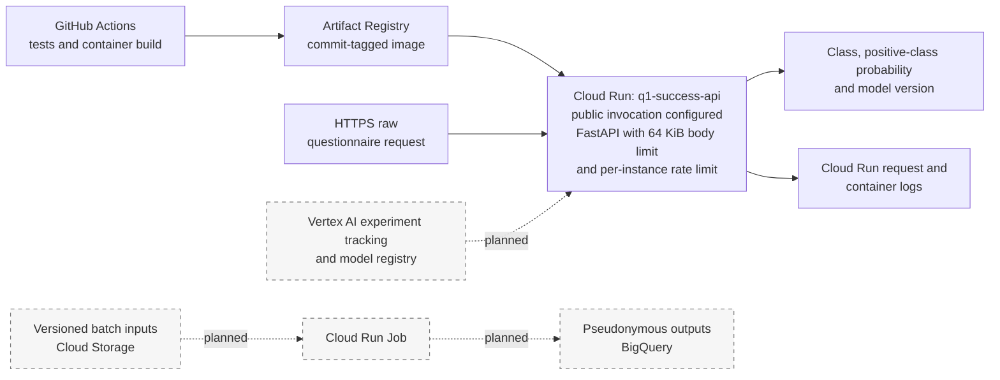

# Associative Classification of Lower or Uncertain Self-Perceived Academic Success in a Global Student Survey

## Abstract

This study evaluates whether responses from a large international survey of higher-education students can distinguish respondents who report lower or uncertain academic success from those who report higher success. The observational dataset contains 22,963 responses and 180 variables collected in seven languages across 120 countries and territories. The binary outcome was derived from Q35a, “I am successful in my studies”: responses 1–3 form the positive lower/uncertain class and responses 4–5 form the higher-success class. After duplicate removal and exclusion of missing outcomes, 17,426 labelled records remained.

The analysis used leakage-controlled preprocessing, four questionnaire-based composite features, ANOVA percentile feature selection, five-fold stratified cross-validation and randomized hyperparameter search. Logistic Regression, K-Nearest Neighbours, Random Forest, Histogram Gradient Boosting and a multilayer perceptron were compared using positive-class F1 as the selection criterion. Logistic Regression achieved the highest cross-validated F1 (0.6011 ± 0.0107) and was selected before test evaluation. On the locked test set it achieved accuracy 0.6546, precision 0.5277, recall 0.6429, F1 0.5796, ROC-AUC 0.7124 and PR-AUC 0.5862. Histogram Gradient Boosting provided stronger overall discrimination but substantially lower positive-class recall.

Permutation importance identified confidence about obtaining a job after study, first-year Bachelor's status and emotion balance as the most influential original inputs. The explanation is associative rather than causal. Gender gaps were comparatively small among supported groups, whereas age and survey-language gaps were substantial. These results, the subjective contemporaneous outcome, target nonresponse and convenience sampling preclude operational use. A serialized FastAPI/Docker package was deployed to Google Cloud Run, and the updated GitHub Actions workflow is configured for public HTTPS inference. The updated application rejects request bodies above 65,536 bytes and applies a 60-request-per-60-second prediction limit within each application instance. Batch processing, staged promotion, load testing, cross-instance edge rate limiting and model-drift automation remain future extensions.

## 1. Introduction

Generative artificial intelligence has become embedded in students' academic work, but its adoption and perceived value differ across disciplines, study settings and demographic contexts. Institutions may wish to understand patterns associated with students' academic experiences, yet predictive work in this area requires care. Survey responses are subjective, cross-sectional and often structurally incomplete; a model can identify associations without establishing that ChatGPT use improves or harms achievement.

This study develops an associative classifier for a single survey statement: “I am successful in my studies.” The positive class represents lower or uncertain self-perceived success, not objective failure, a diagnosis or a verified need for intervention. The analysis asks three practical questions:

1. How reliably can earlier questionnaire responses distinguish the two outcome groups?
2. What performance trade-offs arise across complementary model families?
3. Which inputs influence the fitted model, and does its error behaviour vary across audited subgroups?

The intended contribution is a reproducible benchmark built from a large, multilingual survey. It is not a prospective early-warning system. Asking Q35a directly is simpler and more transparent than inferring it from a long contemporaneous questionnaire; any support-oriented application would need a shorter prospective instrument, an objective outcome and independent validation.

### 1.1 Related research

Recent research provides two relevant strands: studies of student perceptions and use of generative AI, and academic-performance prediction using educational records or digital traces.

| Study | Data and method | Relevant finding | Limitation for the present context |
|---|---|---|---|
| Ravšelj et al. (2025) | Large global student survey; descriptive analysis and ordinal regression | Perceptions and uses of ChatGPT vary across tasks and student contexts | Convenience sampling and self-report do not support representative or causal claims |
| Yağcı (2022) | 1,854 students; six classical classifiers using midterm grade, department and faculty | Several model families predicted final-exam categories with useful accuracy | One Turkish-language course and a strong prior-grade predictor limit transferability |
| Li et al. (2022) | Multi-source campus behaviour; LSTM and two-dimensional CNN | Heterogeneous behavioural sources improved achievement classification | Institution-specific digital traces and objective outcomes differ from a global perception survey |
| Youssef et al. (2024) | 353 UAE students; cross-sectional PLS-SEM | ChatGPT use was associated with engagement, critical thinking and reported achievement | Small local sample and cross-sectional design cannot establish effects |
| Smerdon (2024) | Mixed-method study of permitted AI use in an undergraduate assessment | AI adopters did not achieve higher assignment scores; prior performance influenced adoption | One assessment and voluntary adoption constrain generalisation |
| Baek, Tate and Warschauer (2024) | 1,001 US college students; regression and thematic analysis | Use varied with demographic, study and institutional-policy context | US self-report data do not establish transferability to multilingual settings |

Academic-prediction studies often rely on grades, learning-management records or campus traces, while generative-AI studies frequently remain regional or explanatory. The present analysis instead compares linear, distance-based, tree, boosting and neural-network classifiers on a large cross-national survey, performs feature selection inside validation folds, and combines model explanation with subgroup error auditing. This closes a methodological gap without converting cross-sectional association into a causal or operational claim.

## 2. Data and Methods

### 2.1 Dataset and study design

The data are from *Higher Education Students’ Evolving Perceptions of ChatGPT: Global Survey Data from the Academic Year 2024–2025*, Mendeley Data version 2 (Aristovnik et al., 2025; DOI [10.17632/nv2343nwsb.2](https://doi.org/10.17632/nv2343nwsb.2)). The CC BY 4.0 dataset contains anonymous survey responses collected between October 2024 and February 2025 through convenience sampling. The questionnaire was offered in Arabic, English, Hebrew, Italian, Japanese, Spanish and Turkish. It covers student context, ChatGPT use, perceived capabilities, regulation and ethics, satisfaction, study outcomes, skills, emotions and study information.

The raw workbook contained 22,963 rows and 180 columns. Its mixture of ordinal Likert items, binary indicators, nominal categories, age, high-cardinality text and routed question blocks makes it suitable for evaluating a realistic tabular-learning pipeline.

### 2.2 Outcome and predictor governance

Q35a asks respondents to rate “I am successful in my studies” on a five-point agreement scale. The outcome was defined as:

- **Class 1 — lower or uncertain self-perceived success:** Q35a responses 1, 2 or 3.
- **Class 0 — higher self-perceived success:** Q35a responses 4 or 5.

The grouping makes uncertainty part of the support-oriented positive class, but it does not imply academic failure. Missing outcomes were excluded rather than imputed.

Candidate predictors were restricted to Q1–Q34. Questions Q35b–Q40 were excluded to reduce direct same-section proxying. Institution, free text, citizenship, country of study, gender, age and survey language were not used for prediction because of privacy, cardinality or fairness concerns. Gender, age and survey language were retained separately only for subgroup auditing. The component items used to construct four composites were removed after aggregation, avoiding redundant inclusion of the same information.

### 2.3 Data quality and cleaning

The raw audit demonstrated substantial but interpretable data-quality challenges.

| Finding | Observed value | Treatment |
|---|---:|---|
| Raw dimensions | 22,963 × 180 | Preserved for the initial audit |
| Exact duplicate excess rows | 127 | Removed before splitting |
| Overall missing-cell rate | 23.0413% | Handled by routing-aware exclusions and fold-fitted imputation |
| Rows with at least one missing value | 22,403 | Retained where the outcome was available |
| Raw non-missing Q35a responses | 17,427 | Used after deduplication |
| Institution values | 8,662 unique | Excluded rather than high-dimensional encoding |
| Q13f free-text missingness | 94.6348% | Free text excluded |
| Missing outcomes after deduplication | 5,410 | Removed; never imputed |
| Invalid coded questionnaire responses | 0 | No correction required |

Two ages written as text were recovered. Two invalid age values were changed to missing. The age interquartile-range rule produced fences of 18–30 and identified 1,490 observations outside them; these ages remained within the documented 18–100 domain and were therefore retained for descriptive and fairness analysis rather than mechanically clipped. Age was not a model input.

Missingness is partly structural because questionnaire routing depends on earlier answers. A missing indicator can help a model represent absence, but it cannot distinguish routing from nonresponse or survey attrition. This uncertainty is retained as a limitation. Excluding 5,410 records with no outcome may also create selection bias if respondents who omitted Q35a differ systematically from the labelled sample.

After cleaning, the analysis sample contained 17,426 respondents:

| Outcome class | Count | Share |
|---|---:|---:|
| Higher self-perceived success (0) | 10,971 | 62.958% |
| Lower/uncertain self-perceived success (1) | 6,455 | 37.042% |

The imbalance is moderate rather than extreme. Exploratory plots in the companion notebook examine missingness, target distribution, continuous composites, target rates by study context and a focused Spearman correlation matrix. Unadjusted outcome rates vary by study level, field and learning mode, while related constructs are correlated. These patterns justify aggregation and supervised feature selection, but they are not independent or causal effects.

### 2.4 Composite feature construction

Four row-wise features summarize related questionnaire blocks. Minimum-answer rules prevent a sparse row from being treated as a reliable composite.

| Feature | Definition | Minimum coverage | Non-missing |
|---|---|---:|---:|
| ChatGPT task breadth rate | Proportion of answered Q18 task items used at least “Sometimes” | 10 of 12 tasks | 15,413 |
| Capability mean | Mean of Q19a–Q19j perceived-capability items | 8 of 10 items | 15,424 |
| Ethical-concern mean | Mean of Q22a–Q22j concern items | 8 of 10 items | 15,416 |
| Emotion balance | Mean of positive-emotion items minus mean of negative-emotion items | 6 of 7 items in each block | 15,384 |

Task breadth ranges from 0 to 1 and normalizes use across answered tasks. Capability and ethical-concern means range from 1 to 5. Emotion balance ranges from −4 to 4, with larger values indicating that positive emotions dominate negative emotions. The resulting pre-encoding model matrix contained 98 inputs: 10 nominal, 84 ordinal and four engineered continuous variables.

### 2.5 Train-test split and preprocessing

A single stratified 80:20 split was created with a fixed random seed.

| Partition | Rows | Positive cases | Positive rate |
|---|---:|---:|---:|
| Training | 13,940 | 5,164 | 0.370445 |
| Locked test | 3,486 | 1,291 | 0.370338 |

All learned preprocessing operations were placed inside each model pipeline so that they were fitted independently within each cross-validation training fold:

- engineered continuous variables: median imputation with missing indicators and robust scaling;
- ordinal variables: median imputation with missing indicators and standard scaling;
- nominal variables: an explicit missing category and one-hot encoding;
- feature selection: ANOVA SelectPercentile, searched over 25%, 50% and 75%.

The final Logistic Regression pipeline expanded the data to 215 encoded columns and retained 107 (49.77%). ANOVA selection is computationally efficient and guarantees a genuine subset, but it evaluates univariate mean separation and may overlook interaction-only features.

No synthetic resampling was applied. The class ratio did not justify introducing synthetic questionnaire profiles, while regularization and supported class-weight settings were included in model search. The decision threshold remained 0.50 because no asymmetric error cost was assumed. It was not optimized on the test set.

### 2.6 Model development and validation

Five complementary classifier families were used.

| Model | Category | Rationale |
|---|---|---|
| Logistic Regression | Linear | Regularized, probabilistic and comparatively interpretable baseline |
| K-Nearest Neighbours | Distance based | Tests local similarity after scaling |
| Random Forest | Tree based | Represents nonlinearities and interactions with bagged trees |
| Histogram Gradient Boosting | Ensemble boosting | Efficient regularized boosting for medium-sized tabular data |
| Multilayer perceptron | Artificial neural network | Tests nonlinear representation learning with two hidden layers |

Each family used the same materialized five stratified folds and six randomized parameter combinations, yielding 30 fits per family and 150 fits overall. Positive-class F1 was the primary selection score because it balances precision and recall for the lower/uncertain class. Accuracy, precision, recall, F1, ROC-AUC and PR-AUC were recorded for every model. The search is deliberately resource-conscious rather than exhaustive.

### 2.7 Explanation, error and fairness methods

Permutation importance was calculated on a fixed stratified sample of 1,200 test observations with three shuffles per input and positive-class F1 scoring. This measures the performance decrease when an original input is disrupted. It is model-agnostic but can dilute importance across correlated variables or combine a value effect with its missingness pattern.

Partial dependence was used to inspect isolated average model response for influential engineered inputs. A separate quantile-bin summary retained the observed joint distribution and compared actual positive rates with mean predicted probabilities. Neither view is causal.

Error analysis separated false positives, false negatives and correct classifications, compared median profiles and inspected errors with confidence at least 0.80. Fairness auditing considered gender, age band and survey language, none of which was used for prediction. A subgroup estimate was reported only when the group contained at least 100 observations and at least 30 cases from each true class. True-positive-rate, false-positive-rate and predicted-positive-rate gaps were calculated across supported groups.

## 3. Results

### 3.1 Cross-validation and model selection

Training cross-validation produced the following estimates. Precision, recall and F1 refer to the positive lower/uncertain class.

| Model | Accuracy | Precision | Recall | F1 | F1 SD | ROC-AUC | PR-AUC |
|---|---:|---:|---:|---:|---:|---:|---:|
| Logistic Regression | 0.6691 | 0.5430 | 0.6731 | **0.6011** | 0.0107 | 0.7235 | 0.5936 |
| Random Forest | 0.6929 | 0.5856 | 0.5848 | 0.5850 | 0.0146 | 0.7373 | 0.6280 |
| Histogram Gradient Boosting | **0.7095** | **0.6556** | 0.4555 | 0.5370 | 0.0165 | **0.7437** | **0.6470** |
| Multilayer perceptron | 0.6926 | 0.6133 | 0.4715 | 0.5310 | 0.0201 | 0.7197 | 0.6132 |
| K-Nearest Neighbours | 0.6727 | 0.5692 | 0.4791 | 0.5201 | 0.0155 | 0.6906 | 0.5685 |

Logistic Regression achieved the strongest positive-class F1 and recall. Histogram Gradient Boosting led on accuracy and ranking metrics but identified fewer positive cases at the 0.50 threshold. Logistic Regression was therefore selected from training data before the test set was evaluated. The saved table abbreviates the selected parameter dictionaries; no undisplayed parameter value is inferred in this report.

### 3.2 Locked-test comparison

| Model | Accuracy | Precision | Recall | F1 | ROC-AUC | PR-AUC |
|---|---:|---:|---:|---:|---:|---:|
| Logistic Regression | 0.6546 | 0.5277 | **0.6429** | **0.5796** | 0.7124 | 0.5862 |
| Random Forest | 0.6799 | 0.5673 | 0.5716 | 0.5694 | 0.7209 | 0.6230 |
| Histogram Gradient Boosting | **0.7022** | 0.6365 | 0.4570 | 0.5320 | **0.7344** | **0.6337** |
| Multilayer perceptron | 0.6925 | **0.6435** | 0.3803 | 0.4781 | 0.7116 | 0.6050 |
| K-Nearest Neighbours | 0.6810 | 0.5833 | 0.4857 | 0.5300 | 0.6925 | 0.5779 |

The holdout preserves the cross-validation trade-off. Histogram Gradient Boosting is the strongest overall ranker and has the highest accuracy, but its positive-class recall is 0.4570. Logistic Regression retains the best positive-class recall and F1. The test set describes generalization and was not used to rerank the candidates.

For the selected model, the higher-success class achieved precision 0.7590, recall 0.6615 and F1 0.7069. The lower/uncertain class achieved precision 0.5277, recall 0.6429 and F1 0.5796. Overall accuracy was 0.6546, macro F1 was 0.6433 and weighted F1 was 0.6598. PR-AUC 0.5862 exceeds the positive prevalence of 0.3703, while ROC-AUC 0.7124 indicates moderate rather than strong discrimination.

### 3.3 Error analysis

The selected model's confusion matrix is:

|  | Predicted higher | Predicted lower/uncertain |
|---|---:|---:|
| **Actual higher** | 1,452 | 743 |
| **Actual lower/uncertain** | 461 | 830 |

There were 2,282 correct classifications (65.462%), 743 false positives (21.314% of the test set) and 461 false negatives (13.224%). A false positive assigns a lower/uncertain label to a respondent who reported higher success; a false negative misses a respondent in the lower/uncertain class. No asymmetric cost was used during selection, so neither error type is declared universally more important. A future support setting would need to define costs prospectively and choose any threshold using validation data rather than the locked test set.

Median profiles show overlap rather than a clean separation. Correct cases had median age 21, capability mean 3.7, ethical-concern mean 3.0, emotion balance 1.0 and confidence 0.674. False negatives had median age 22, capability 3.7, ethical concern 3.1, emotion balance 1.143 and confidence 0.608. False positives had median age 21, capability 3.5, ethical concern 3.0, emotion balance 0.571 and confidence 0.617. Seventy-three errors were made with confidence at least 0.80, including a maximum displayed confidence of approximately 0.981. These failures show that a probability score must not be treated as certainty and that automated high-stakes action would be unsafe.

### 3.4 Model explanation

The strongest permutation effects were:

| Rank | Input | Questionnaire meaning | Mean F1 decrease | SD |
|---:|---|---|---:|---:|
| 1 | Q12 | Confidence about obtaining a job after completing studies | 0.0513 | 0.0015 |
| 2 | Q9 | First-year student in a Bachelor's degree | 0.0189 | 0.0068 |
| 3 | Emotion balance | Positive-emotion mean minus negative-emotion mean | 0.0135 | 0.0081 |
| 4 | Q10 | Main field of study | 0.0098 | 0.0027 |
| 5 | Q25a | Perception that ChatGPT use is under the respondent's control | 0.0091 | 0.0035 |

Q12 has a considerably larger permutation effect than the remaining inputs, but importance does not provide direction or causality. It shows that disrupting job-confidence information reduces the fitted pipeline's F1 on the explanation sample. Q9 and Q10 may partly represent differences in study stage or discipline; they should not be converted into deterministic student profiles.

The saved partial-dependence curves for the displayed engineered features are approximately flat around the average prediction, so they do not justify a claim of a strong isolated marginal effect. The observed emotion-balance bins show a different descriptive association:

| Emotion-balance bin | N | Actual positive rate | Mean predicted probability |
|---|---:|---:|---:|
| −4.001 to 0 | 756 | 0.4921 | 0.5814 |
| 0 to 0.571 | 483 | 0.4369 | 0.5386 |
| 0.571 to 1.143 | 637 | 0.3344 | 0.4744 |
| 1.143 to 1.857 | 624 | 0.3285 | 0.4236 |
| 1.857 to 4 | 594 | 0.2492 | 0.3553 |

The positive rate and mean predicted probability both decline as emotion balance increases. This binning leaves other correlated survey responses free to vary, whereas partial dependence averages predictions after varying one feature. Their difference is therefore informative: the observed trend may represent a broader correlated response profile rather than a strong isolated emotion-balance effect.

### 3.5 Subgroup audit

| Audited attribute | Supported groups | TPR gap | FPR gap | Predicted-positive-rate gap |
|---|---:|---:|---:|---:|
| Gender | 2 | 0.0408 | 0.0077 | 0.0026 |
| Age band | 4 | 0.2649 | 0.1912 | 0.2587 |
| Survey language | 5 | 0.2428 | 0.2109 | 0.1987 |

Among the supported gender groups, female and male predicted-positive rates were almost identical (0.4510 and 0.4484), and their TPR and FPR gaps were comparatively small. Other gender categories were suppressed because their total or class-specific counts were insufficient.

Age performance varied more strongly. TPR declined from 0.7093 for ages 18–21 to 0.4444 for ages 30–39, while FPR declined from 0.4040 to 0.2128. Survey-language TPR ranged from 0.7222 for Arabic to 0.4795 for Italian, and FPR ranged from 0.4302 to 0.2193 across the same groups. Hebrew and Japanese estimates, ages 40+ and several small groups were suppressed under the stated support rule.

These are descriptive point estimates without confidence intervals. Gaps may reflect convenience sampling, country composition, translation, survey interpretation, response styles and true construct differences as well as model behaviour. They are not proof of discrimination or fairness. Nevertheless, the age and language differences are large enough to block operational use until representative external validation, translation and measurement review, uncertainty estimation and subgroup-specific error investigation have been completed.

## 4. Deployment and MLOps Implementation

### 4.1 Validated model package

The notebook generated a self-contained package with:

- `model.joblib`: complete preprocessing, feature selection and Logistic Regression pipeline;
- `feature_schema.json`: accepted raw fields, ranges, feature order and composite rules;
- `metadata.json`: model version, data checksum, class labels, threshold, metrics and limitations;
- `app.py`: FastAPI application with `/health`, `/model-info` and `/predict`, request-body size enforcement and per-instance prediction rate limiting;
- `requirements.txt`, `Dockerfile` and `api_contract.json`.

The application source compiled, the serialized model reproduced the in-memory probabilities, and a raw questionnaire record passed validation and recreated all four engineered features. Its prepared model row and prediction matched the notebook pipeline. The current deployment suite contains 27 tests covering package integrity, schema consistency, model reload parity, composite reconstruction, input validation, metadata, successful prediction, request-size enforcement and rate-limit behaviour.

The previously verified deployment, commit `640da54`, triggered [GitHub Actions run 29687702433](https://github.com/senavirathne/MSc-Data-Science-Macine-Leanring-CW-2025/actions/runs/29687702433). Both jobs completed successfully: the first recreated the Python 3.12 environment and ran the automated tests; the second built the Docker image, pushed it to Artifact Registry and deployed the `q1-success-api` service to Cloud Run. Authenticated post-deployment requests to `/health` and `/model-info` passed, the returned metadata identified model version `q1-v1`, target `lower_or_uncertain_self_perceived_success` and Logistic Regression, and the workflow verified that the latest ready revision received 100% of traffic. The current workflow revision is configured to change invocation to public HTTPS and to test the deployed informational endpoints without an identity token.

### 4.2 Implemented Google Cloud deployment and planned extensions

The updated application and workflow configure real-time inference as a public HTTPS `POST /predict` call to the `q1-success-api` Cloud Run service. Before route processing, pure ASGI middleware rejects request bodies above 65,536 bytes. A sliding-window control admits 60 prediction requests per 60 seconds within each application instance and returns HTTP 429 with `Retry-After` when that limit is exceeded. The application then validates recognised raw Q6–Q34 fields, enforces documented value ranges and minimum coverage, reconstructs the same four composites used in training, and returns the class label, positive-class probability and model version. The service is configured with one CPU, 1 GiB memory, zero minimum instances and a maximum of three instances.

Cloud Run is appropriate for intermittent coursework traffic because it provides managed autoscaling and scale-to-zero without cluster administration. Artifact Registry stores an image tagged with the source commit, while Cloud Run resolves the deployed revision to an image digest. Scheduled cohort scoring through a Cloud Run Job, versioned Cloud Storage inputs, governed BigQuery outputs, Vertex AI experiment tracking and a model registry remain proposed extensions. Batch inference is therefore not presented as an implemented `/batch-predict` endpoint.

### 4.3 CI/CD, monitoring and governance

The current delivery workflow is configured as follows:

1. A change to the deployment package or workflow on `main` triggers GitHub Actions; pull requests execute the test job without deployment.
2. CI installs the pinned Python 3.12 runtime, validates required files and JSON metadata, compiles and imports the application, and executes 27 automated tests.
3. A Docker image is built and tagged with the immutable Git commit identifier, then authenticated to Google Cloud through Workload Identity Federation and pushed to Artifact Registry.
4. The workflow deploys a publicly invocable Cloud Run revision with unrestricted internet ingress, the configured runtime service account, scale-to-zero settings and explicit application-protection environment variables.
5. It sends unauthenticated requests to the deployed `/health` and `/model-info` endpoints.
6. It verifies the expected Q1 model metadata and confirms that the latest ready revision receives 100% of service traffic.

The present workflow promotes a successful revision directly to 100% traffic. Container vulnerability scanning, a no-traffic candidate revision, a live post-deployment `/predict` request, human approval, gradual traffic migration and automated rollback are not currently implemented. They would be appropriate controls before any use beyond this coursework proof of concept.

Operational monitoring should combine service and model signals:

- request count, latency, memory, container restarts and error status;
- schema violations, missingness, unknown categories and composite coverage;
- feature-distribution and predicted-probability drift against an approved baseline;
- delayed accuracy, recall, F1, PR-AUC, calibration and subgroup gaps when trustworthy outcomes become available;
- logging of model version and pseudonymous request identifiers without raw survey payloads.

The deployed Cloud Run service provides platform request and container logs, but the model-monitoring signals above, alert policies and load tests have not been configured. A future production-oriented implementation should notify responsible owners when technical error rates, latency, schema failures or drift exceed approved limits. Retraining may run termly or after a confirmed drift event through a Vertex AI Pipeline. New data must pass quality and representativeness checks, training-only cross-validation, locked evaluation, fairness gates and human review before registry promotion. An automated schedule should never bypass these gates.

Deployment authentication uses Workload Identity Federation instead of a stored Google service-account key, while the container runs under a configured Cloud Run service account and TLS protects service traffic. The updated workflow deliberately configures public invocation for this coursework API. The application limits request bodies to 65,536 bytes and uses a shared in-memory prediction quota within each instance. This quota limits work accepted by one instance; it is not a per-client control, resets with the instance and is not coordinated across autoscaled instances. A future external HTTPS load balancer and Cloud Armor policy, combined with restricted direct Cloud Run ingress, would provide stronger shared edge enforcement. Direct identifiers, institution and free text are excluded from the inference schema and should not be collected. Least-privilege role review, explicit log-retention limits, alerting, audit review and role-based access to any future batch outputs remain governance requirements. Any participant-facing process should be voluntary, transparent, human reviewed and open to challenge.

## 5. Discussion

### 5.1 Interpretation and model suitability

The study demonstrates moderate predictive signal but not operational reliability. Logistic Regression is technically attractive because its complete artifact is small, inference is fast, preprocessing is serialized with the estimator and its linear form is more inspectable than the nonlinear alternatives. It also achieved the strongest positive-class F1 under the pre-specified selection rule.

That selection does not mean Logistic Regression dominates every objective. Histogram Gradient Boosting has better accuracy, ROC-AUC and PR-AUC and would be preferable if ranking quality or overall accuracy were the governing objective. Its lower recall at 0.50 makes it less suitable for the present balanced positive-class F1 criterion. This distinction is important: model choice depends on a declared objective, and test results should not be used opportunistically to rewrite it.

The positive-class precision of 0.5277 means that nearly half of the respondents labelled lower/uncertain by the selected model actually reported higher success. Recall of 0.6429 means that more than one third of positive cases were missed. Together with 73 high-confidence errors, these results rule out autonomous academic decisions. The score may be adequate for methodological comparison, but not for grading, diagnosis, discipline, access restriction or unreviewed support allocation.

### 5.2 Limitations

Several limitations define the interpretation:

1. **Contemporaneous subjective outcome.** Predictors and Q35a come from the same survey. The model reconstructs one self-report from other self-reports; it does not forecast a later objective outcome.
2. **Direct questioning is preferable.** If the aim is to understand perceived success, asking Q35a is more transparent than indirect inference.
3. **Convenience sampling.** Countries, languages and institutions are not represented proportionally, so aggregate metrics are not population estimates.
4. **Target nonresponse.** Removing 5,410 post-deduplication records without Q35a may introduce selection bias.
5. **Structural missingness.** Routing, nonresponse and attrition cannot be separated from the saved missing indicators.
6. **Correlated questionnaire constructs.** Permutation and bin-based explanations can reflect shared information rather than isolated feature effects.
7. **Resource-conscious tuning.** Six randomized candidates per family support a fair executable comparison but do not establish globally optimal hyperparameters.
8. **Subgroup uncertainty.** Several groups were suppressed, and confidence intervals were not estimated for reported fairness metrics.
9. **No external validation.** Cultural, temporal, institutional and translation transfer remain untested.
10. **Cloud validation remains limited.** The previously recorded run verified CI tests, the Docker build, Artifact Registry push, Cloud Run deployment, authenticated health and metadata checks, and latest-revision traffic assignment. The current public-access, request-size and rate-limit revision passed locally in the 27-test suite and is configured to run through the same suite in CI, but it requires a new successful deployment run for equivalent cloud evidence. The post-deployment job does not exercise `/predict`, and no staged rollout, load test, prolonged availability study, drift monitoring or external security assessment was performed.

Future research should define a prospective prediction time, use a shorter voluntary instrument, collect a meaningful later outcome, examine target nonresponse, validate translations and measurement invariance, estimate subgroup uncertainty, assess probability calibration and conduct external validation before considering a support workflow.

## 6. Conclusion

A leakage-controlled comparison of five supervised-learning families was completed on 17,426 labelled responses from a large global higher-education survey. Logistic Regression was selected by training cross-validation and achieved test F1 0.5796, recall 0.6429, ROC-AUC 0.7124 and PR-AUC 0.5862 for lower or uncertain self-perceived success. Boosting ranked respondents more effectively overall but identified fewer positive cases at the default threshold.

The strongest fitted dependencies involved employment confidence, study stage and emotion balance, but they remain associative. Small supported gender gaps coexist with substantial age and language gaps, modest predictive performance and high-confidence errors. The pipeline is reproducible and packaged for public Cloud Run deployment with application-level request controls; the earlier IAM-protected revision establishes technical deployability, while the updated public revision still requires successful deployment verification. This does not establish suitability for operational academic decision-making. A prospective outcome, representative external validation, fairness investigation and human governance are prerequisites for any future use beyond technical demonstration.

## References

Aristovnik, A., et al. (2025). *Higher Education Students’ Evolving Perceptions of ChatGPT: Global Survey Data from the Academic Year 2024–2025* (Version 2) [Dataset]. Mendeley Data. [https://doi.org/10.17632/nv2343nwsb.2](https://doi.org/10.17632/nv2343nwsb.2)

Baek, C., Tate, T., & Warschauer, M. (2024). “ChatGPT seems too good to be true”: College students’ use and perceptions of generative AI. *Computers and Education: Artificial Intelligence, 7*, 100294. [https://doi.org/10.1016/j.caeai.2024.100294](https://doi.org/10.1016/j.caeai.2024.100294)

Li, X., Zhang, Y., Cheng, H., Li, M., & Yin, B. (2022). Student achievement prediction using deep neural network from multi-source campus data. *Complex & Intelligent Systems, 8*, 5143–5156. [https://doi.org/10.1007/s40747-022-00731-8](https://doi.org/10.1007/s40747-022-00731-8)

Ravšelj, D., Keržič, D., Tomaževič, N., Umek, L., Brezovar, N., et al. (2025). Higher education students’ perceptions of ChatGPT: A global study of early reactions. *PLOS ONE, 20*(2), e0315011. [https://doi.org/10.1371/journal.pone.0315011](https://doi.org/10.1371/journal.pone.0315011)

Smerdon, D. (2024). AI in essay-based assessment: Student adoption, usage, and performance. *Computers and Education: Artificial Intelligence, 7*, 100288. [https://doi.org/10.1016/j.caeai.2024.100288](https://doi.org/10.1016/j.caeai.2024.100288)

Yağcı, M. (2022). Educational data mining: Prediction of students’ academic performance using machine learning algorithms. *Smart Learning Environments, 9*, 11. [https://doi.org/10.1186/s40561-022-00192-z](https://doi.org/10.1186/s40561-022-00192-z)

Youssef, E., Medhat, M., Abdellatif, S., & Al Malek, M. (2024). Examining the effect of ChatGPT usage on students’ academic learning and achievement: A survey-based study in Ajman, UAE. *Computers and Education: Artificial Intelligence, 7*, 100316. [https://doi.org/10.1016/j.caeai.2024.100316](https://doi.org/10.1016/j.caeai.2024.100316)
