# Brent Crude Oil Price Forecasting and Volatility Analysis

## 1. Introduction, Data Context, and Forecasting Objective

### 1.1 Analytical Context

Brent crude oil is one of the most important global oil benchmarks. It affects
energy prices, shipping costs, airline fuel expenditure, inflation expectations,
fiscal planning in oil-exporting economies, and risk management across commodity
markets. Forecasting Brent prices is difficult because prices respond to
supply-demand fundamentals, geopolitical events, OPEC decisions, financial
stress, currency movements, transportation disruptions, and unexpected shocks.

This analysis focuses on two related questions:

1. How accurately can daily Brent crude oil prices be forecast 30 business days
   ahead using only historical price-derived information?
2. Does the return series exhibit volatility clustering, and can a GARCH model
   provide useful short-term risk estimates?

### 1.2 Data Source and Scope

The dataset is the **Europe Brent Spot Price FOB** series, obtained through FRED
under code **DCOILBRENTEU**, which republishes the U.S. Energy Information
Administration data. The series is measured in **U.S. dollars per barrel**, has
**daily frequency**, and is **not seasonally adjusted**.

| Property                                     | Value                                  |
| -------------------------------------------- | -------------------------------------- |
| Series                                       | Europe Brent Spot Price FOB            |
| FRED code                                    | `DCOILBRENTEU`                         |
| Original source                              | U.S. Energy Information Administration |
| Period analysed                              | 2005-01-03 to 2025-12-31               |
| Frequency                                    | Daily / business-day observations      |
| Unit                                         | USD per barrel                         |
| Raw loaded shape                             | 5,478 rows x 1 column                  |
| Non-null raw price observations              | 5,315                                  |
| Missing values after business-day reindexing | 163                                    |
| Final supervised modelling dataset           | 5,038 rows x 67 columns                |

The long historical window captures multiple oil-market regimes, including
high-price periods, collapse periods, pandemic volatility, and post-2022
energy-market changes. This makes the dataset suitable for testing both price
forecasting and volatility modelling methods.

### 1.3 Forecasting Targets

The price forecasting target is the Brent crude oil price 30 business days
ahead:

$$P_{t+30}$$

where \(P_t\) is the Brent crude oil price in USD per barrel on business day
\(t\). The supervised target is `target_price_30d_ahead`.

For volatility modelling, prices are transformed into daily logarithmic returns:

$$r_t = 100 \times \ln\left(\frac{P_t}{P_{t-1}}\right)$$

This return transformation is appropriate because GARCH models estimate
conditional variance and volatility persistence rather than direct price levels.

| Modelling Purpose      | Target                                       | Horizon          |
| ---------------------- | -------------------------------------------- | ---------------- |
| Price forecasting      | Brent price \(P_{t+30}\)                     | 30 business days |
| Volatility forecasting | Conditional variance / volatility of \(r_t\) | 30 business days |

### 1.4 Literature Context and Model Rationale

Recent crude oil forecasting research supports using a comparative framework
rather than relying on a single modelling method. Traditional models provide
transparent baselines, machine learning can use engineered lag and
rolling-window features, deep learning can learn sequence patterns, and GARCH
remains important for volatility persistence.

| Study                       | Models / Focus                                               | Key Findings                                                                                             | Relevance to This Analysis                                                                  |
| --------------------------- | ------------------------------------------------------------ | -------------------------------------------------------------------------------------------------------- | ------------------------------------------------------------------------------------------- |
| Ziolkowski (2024)           | LSTM, Prophet, XGBoost for WTI and Brent spot prices         | Compares traditional and advanced models for crude spot-price prediction.                                | Supports multi-model comparison.                                                            |
| Zhang & Lahmiri (2025)      | Deep learning ensemble for Brent and WTI                     | Designs ensemble deep-learning systems for crude oil prediction.                                         | Supports testing deep learning while comparing it against simpler baselines.                |
| Yilmaz & Zehir (2026)       | Brent returns and strategic risk indicators                  | Examines Brent sensitivity to geopolitical, financial, and strategic risk indicators.                    | Highlights the value of exogenous risk indicators not present in a univariate price series. |
| Zhao, Hu & Wang (2024)      | LSTM for Brent under low-carbon transition                   | Finds that LSTM can capture broad trends but may deviate during sharp fluctuations.                      | Supports using LSTM while acknowledging its limits during shocks.                           |
| Alruqimi & Di Persio (2024) | Ensemble Bi-GRU for multi-step Brent forecasting             | Shows that multi-step forecasting is difficult for volatile crude oil series.                            | Supports evaluating multi-step models with MAE, RMSE, MAPE, and sMAPE.                      |
| Cohen (2025)                | Econometric and ML techniques for short-term oil forecasting | Finds that ML ensembles can improve forecasts when richer market features are available.                 | Explains why univariate ML may underperform without exogenous predictors.                   |
| Chung (2024)                | Energy volatility forecasting using GARCH and ML             | Shows that GARCH remains useful for volatility persistence even when ML performs strongly out of sample. | Justifies using GARCH as a separate risk model.                                             |

The reviewed literature also highlights important limitations. Brent prices
react to external events that are not fully captured by historical prices alone.
Traditional models can struggle with nonlinear shocks and structural breaks.
Machine learning models require carefully designed lag features and may still
mostly learn persistence. Deep learning needs careful scaling and validation,
and can smooth away sudden market turning points. GARCH is useful for volatility
but does not forecast price direction or price level.

The model suite therefore includes:

| Model Type              | Model Used      | Role in the Analysis                                                |
| ----------------------- | --------------- | ------------------------------------------------------------------- |
| Baseline                | Naive forecast  | Tests whether any model can beat persistence.                       |
| Traditional time series | SARIMAX / ARIMA | Provides an interpretable autocorrelation-based benchmark.          |
| Machine learning        | XGBoost         | Uses engineered lag, return, rolling-window, and calendar features. |
| Deep learning           | LSTM            | Learns nonlinear temporal patterns from 60-day input sequences.     |
| Volatility model        | GARCH(1,1)      | Models volatility clustering in Brent log returns.                  |

## 2. Time-Series Exploration and Preprocessing

### 2.1 Initial Inspection and Missing Values

The daily Brent series was loaded from FRED and the value column was
standardised as `price`.

| Check                                               |     Result |
| --------------------------------------------------- | ---------: |
| Loaded rows                                         |      5,478 |
| Start date                                          | 2005-01-03 |
| End date                                            | 2025-12-31 |
| Non-null price count                                |      5,315 |
| Raw missing values after business-day reindexing    |        163 |
| Missing values after interpolation in `price_clean` |          0 |

The first date, 2005-01-03, had a missing raw price. After
interpolation/backfilling, `price_clean` was available for all business-day
observations. This approach is reasonable because missing values mainly reflect
holidays, non-trading days, or unavailable business-day observations rather than
meaningful zero prices.

### 2.2 Descriptive Statistics

| Statistic          |    Price |
| ------------------ | -------: |
| Count              |    5,315 |
| Mean               |  75.6925 |
| Standard deviation |  23.6563 |
| Minimum            |   9.1200 |
| 25th percentile    |  58.5550 |
| Median             |  72.5600 |
| 75th percentile    |  91.9800 |
| Maximum            | 143.9500 |

The wide range between the minimum and maximum confirms that the dataset
contains major oil-market regimes and shocks.

### 2.3 Visual Analysis of Price Levels

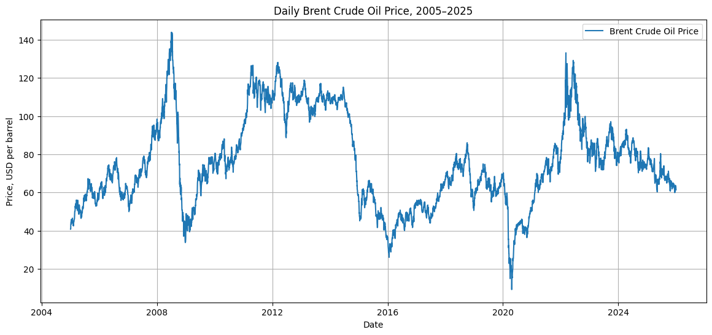

_Figure 1. Daily Brent crude oil price, 2005-2025._

The raw price chart shows strong regime changes: the 2008 price spike and crash,
high prices from around 2011 to 2014, a major fall in 2014-2016, the 2020
pandemic collapse, the 2022 surge, and a gradual decline into 2025. These
movements show that Brent crude oil is not a simple smooth time series. It
contains structural breaks, crisis shocks, and long cycles.

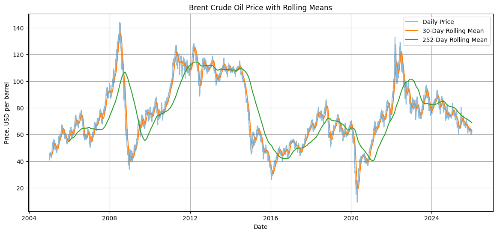

_Figure 2. Brent crude oil price with 30-day and 252-day rolling means._

The 30-day rolling mean follows short-term movements closely, while the 252-day
rolling mean captures longer market regimes. The rolling means confirm that the
series has time-varying trend behaviour and does not remain around one stable
long-term mean.

### 2.4 Rolling Volatility and Log Returns

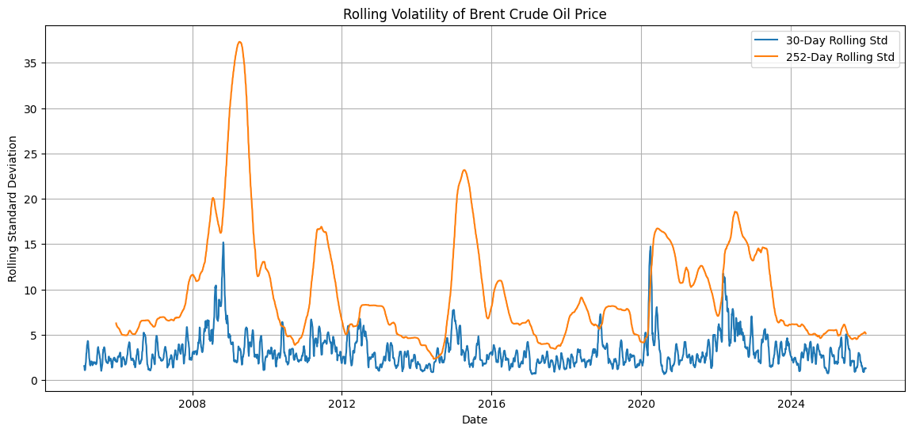

_Figure 3. Rolling volatility of Brent crude oil price._

Rolling volatility changes substantially over time. The strongest volatility
spikes occur around the 2008 financial crisis, the 2014-2016 oil-price collapse,
the 2020 pandemic shock, and the 2022-2023 energy-market disruption. This is
early visual evidence that volatility clustering is present and that GARCH
modelling is justified.

Daily log returns were calculated using:

$$r_t = 100 \times \Delta \ln(P_t)$$

The return series had **5,477 observations**, with mean **0.0075%**, standard
deviation **2.5618%**, minimum **-64.3699%**, and maximum **41.2023%**.

### 2.5 Decomposition and Seasonality

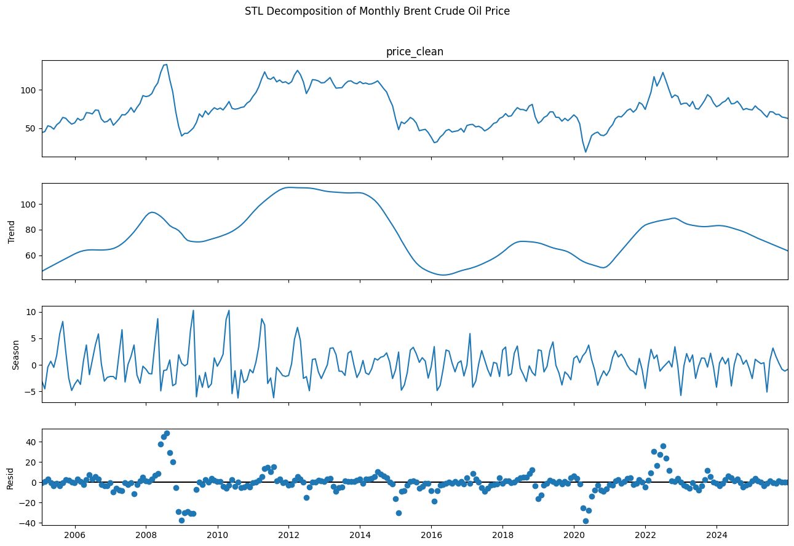

_Figure 4. STL decomposition of monthly Brent crude oil price._

STL decomposition was applied to monthly average prices. The decomposition shows
a strong trend component and a large residual component. The seasonal component
is much weaker than the trend and residual components. This means that simple
calendar seasonality is not the main driver of Brent prices. Instead, shocks,
cycles, and structural market changes dominate.

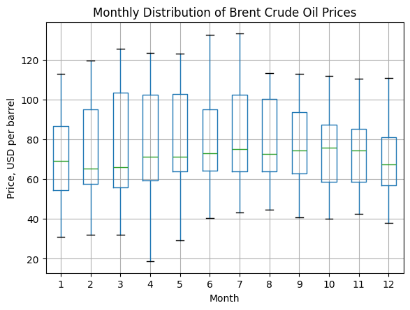

_Figure 5. Monthly distribution of Brent crude oil prices._

The monthly boxplot shows some month-to-month differences, but the distributions
overlap heavily. This supports the conclusion that seasonality exists only
mildly and should not be treated as the dominant forecasting signal.

### 2.6 Outlier Detection and Treatment

Outliers were detected using modified z-scores on daily log returns rather than
raw price levels. This is appropriate because a high or low oil price is not
automatically abnormal in a trending commodity market; a sudden daily percentage
movement is more informative.

The modified z-score procedure detected **46 return outliers**.

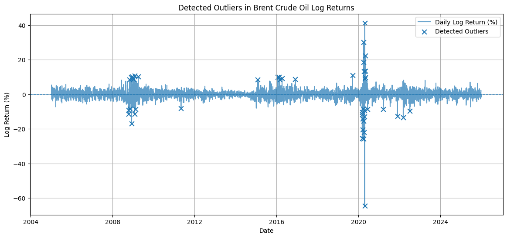

_Figure 6. Detected outliers in Brent crude oil log returns._

The visual outlier plot shows clusters around the 2008 crisis and 2020 pandemic
period, with the most extreme negative and positive movements in 2020. These
observations represent real market shocks, so they were not deleted. Instead,
two robust features were created:

- `return_outlier`, a binary flag.
- `log_return_winsorized`, a robust return feature.

The 1% winsorization limits were:

| Limit                 |   Value |
| --------------------- | ------: |
| Lower 1% return limit | -6.0943 |
| Upper 1% return limit |  6.2699 |

### 2.7 Feature Engineering

Feature engineering produced a modelling dataset with **67 columns** and **5,038
rows** after dropping lag-induced missing values.

Feature groups included:

- Calendar features: year, month, quarter, day of week, day of year.
- Cyclical calendar encodings: month sine/cosine and day-of-year sine/cosine.
- Price lags: 1, 2, 3, 5, 10, 20, 30, and 60 days.
- Return lags using the same lag windows.
- Rolling means, standard deviations, minimums, and maximums.
- Rolling return means and rolling return volatility.
- Outlier and winsorized-return features.
- A 30-business-day-ahead target, `target_price_30d_ahead`.

The final supervised learning setup used **65 predictor features**.

### 2.8 Stationarity Testing

The Augmented Dickey-Fuller test was applied to the price level,
first-differenced price, and log returns.

| Series                    | ADF Statistic | p-value | Conclusion                  |
| ------------------------- | ------------: | ------: | --------------------------- |
| Brent price level         |       -3.1776 |  0.0213 | Reject unit-root null at 5% |
| First difference of price |      -31.4882 |  0.0000 | Stationary                  |
| Log returns               |      -12.1133 |  0.0000 | Stationary                  |

Although the ADF test rejects the unit-root null for the price level, the visual
analysis still shows major regime changes and structural breaks. For price
forecasting, the raw price level is retained because the target is a future
price. For volatility modelling, log returns are more appropriate because they
are centered around zero and better suited to GARCH.

## 3. Price Forecasting Methodology and Results

### 3.1 Train-Validation-Test Split

A chronological split was used instead of random sampling.

| Split      | Period                   |      Shape |
| ---------- | ------------------------ | ---------: |
| Training   | 2005-12-20 to 2019-11-28 | 3,526 x 65 |
| Validation | 2019-11-29 to 2022-11-22 |   756 x 65 |
| Test       | 2022-11-23 to 2025-11-19 |   756 x 65 |

This avoids look-ahead bias because future observations are not used to train
models evaluated on earlier periods.

### 3.2 Models Implemented

Four price forecasting approaches were evaluated:

| Model          | Description                                                           |
| -------------- | --------------------------------------------------------------------- |
| Naive Baseline | Predicts the 30-day-ahead price as the current price.                 |
| SARIMAX        | Traditional ARIMA-style model with rolling-origin 30-day forecasts.   |
| XGBoost        | Gradient-boosted regression model using engineered temporal features. |
| LSTM           | Deep learning sequence model using 60-day historical input windows.   |

### 3.3 SARIMAX Development

The SARIMAX workflow followed the course ARIMA/SARIMA/SARIMAX pattern:
visualise the level series, test stationarity, compare the first difference and
log returns, inspect ACF/PACF behaviour, tune candidate orders on a
time-respecting validation period, and evaluate the selected specification only
on the held-out test period. The ADF tests showed that the price level required
differencing, while the differenced and return series were more appropriate for
ARIMA-style modelling.

The SARIMAX grid tested multiple ARIMA orders and one short seasonal
specification using rolling-origin validation. The best validation model was:

| Parameter      | Selected Value |
| -------------- | -------------- |
| ARIMA order    | (1, 1, 1)      |
| Seasonal order | (0, 0, 0, 0)   |

The final SARIMAX test results were:

| Model   |    MAE |   RMSE | MAPE (%) | sMAPE (%) |
| ------- | -----: | -----: | -------: | --------: |
| SARIMAX | 5.0347 | 6.1989 |   6.4883 |    6.4114 |

### 3.4 XGBoost Development

XGBoost was tuned using time-series cross-validation. The best parameters were:

`n_estimators=500`, `max_depth=3`, `learning_rate=0.01`, `subsample=0.7`,
`colsample_bytree=0.7`, `min_child_weight=3`, `reg_alpha=0.1`, `reg_lambda=2.0`.

The best CV RMSE was **13.7896**. Final test performance was:

| Model   |    MAE |   RMSE | MAPE (%) | sMAPE (%) |
| ------- | -----: | -----: | -------: | --------: |
| XGBoost | 6.7387 | 8.6574 |   8.8663 |    8.5212 |

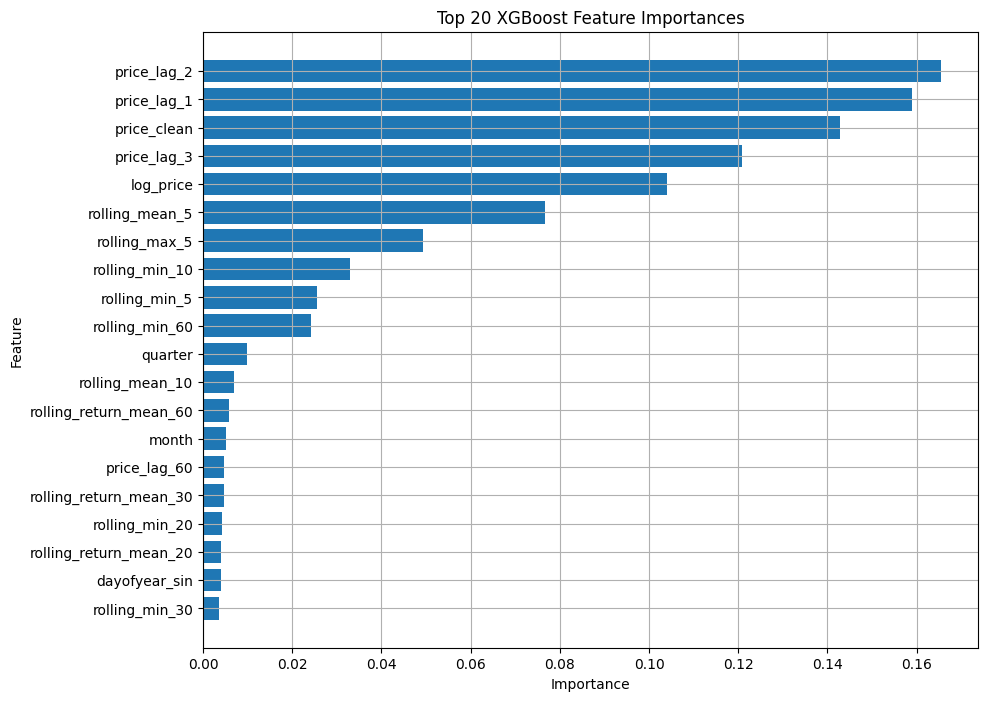

_Figure 7. Top 20 XGBoost feature importances._

The XGBoost importance plot shows that the model relies heavily on recent price
lags and short rolling statistics. The strongest features were `price_lag_2`,
`price_lag_1`, `price_clean`, `price_lag_3`, `log_price`, and `rolling_mean_5`.
This indicates that XGBoost mainly learned persistence and short-term
price-level information rather than a fundamentally different market signal.

### 3.5 LSTM Development

The LSTM used a 60-day lookback window with 65 features. The sequence shapes
were:

| Split           | Shape           |
| --------------- | --------------- |
| LSTM training   | 3,467 x 60 x 65 |
| LSTM validation | 756 x 60 x 65   |
| LSTM test       | 756 x 60 x 65   |

The LSTM configuration was tuned on the validation period by comparing lookback
length, hidden units, dropout, learning rate, batch size, and early-stopping
behaviour. The final configuration retained the validation setting that gave the
best balance between forecast error and overfitting control.

The best LSTM configuration was:

| Hyperparameter |  Value |
| -------------- | -----: |
| LSTM units     |     64 |
| Dropout        |   0.20 |
| Learning rate  | 0.0005 |
| Batch size     |     64 |

The final LSTM test performance was:

| Model |    MAE |   RMSE | MAPE (%) | sMAPE (%) |
| ----- | -----: | -----: | -------: | --------: |
| LSTM  | 5.9370 | 7.3017 |   7.5695 |    7.7119 |

The LSTM workflow follows the course sequence-modelling structure: scale the
series, create 60-day lookback windows, tune model settings on a validation
period, and use early stopping to reduce overfitting.

### 3.6 Final Price Forecasting Comparison

The final test-set comparison used 756 common test dates.

| Rank | Model          |    MAE |   RMSE | MAPE (%) | sMAPE (%) |
| ---: | -------------- | -----: | -----: | -------: | --------: |
|    1 | Naive Baseline | 5.0340 | 6.1968 |   6.4872 |    6.4103 |
|    2 | SARIMAX        | 5.0347 | 6.1989 |   6.4883 |    6.4114 |
|    3 | LSTM           | 5.9370 | 7.3017 |   7.5695 |    7.7119 |
|    4 | XGBoost        | 6.7387 | 8.6574 |   8.8663 |    8.5212 |

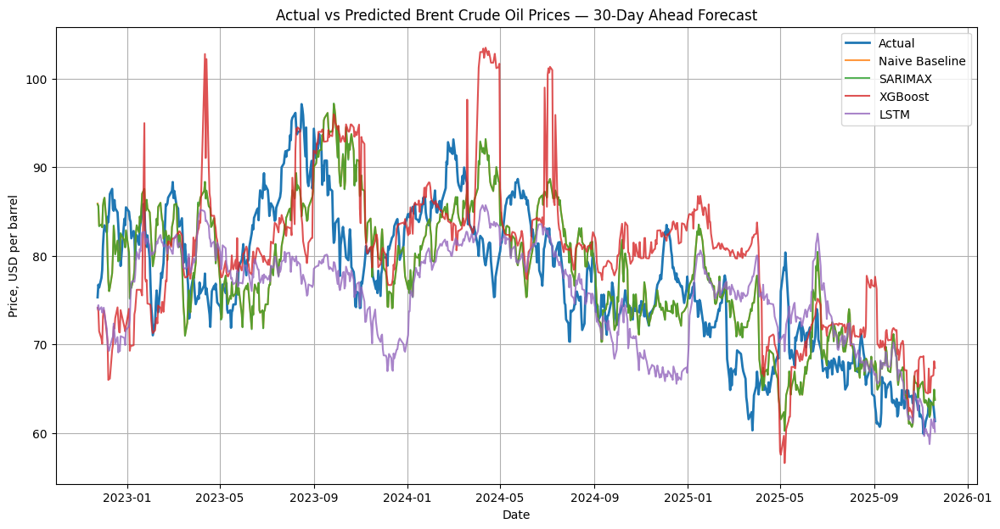

_Figure 8. Actual vs predicted Brent crude oil prices for the 30-day-ahead test
period._

The actual-vs-predicted graph shows that the Naive baseline and SARIMAX track
the actual test series closely. This is because Brent prices have strong
persistence over a 30-business-day horizon. LSTM is smoother and misses some
turning points, while XGBoost shows more unstable deviations and spikes.

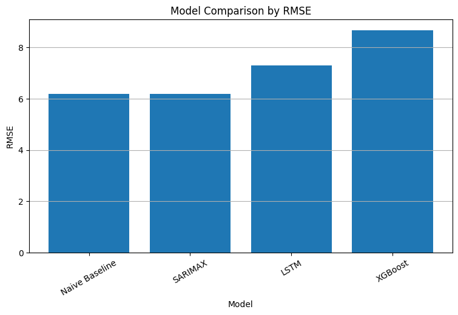

_Figure 9. Model comparison by RMSE._

The RMSE chart confirms that the Naive baseline narrowly outperforms SARIMAX,
while LSTM and XGBoost perform worse. The difference between Naive and SARIMAX
is extremely small, so the practical conclusion is that a persistence-based
forecast is very difficult to beat on this test period.

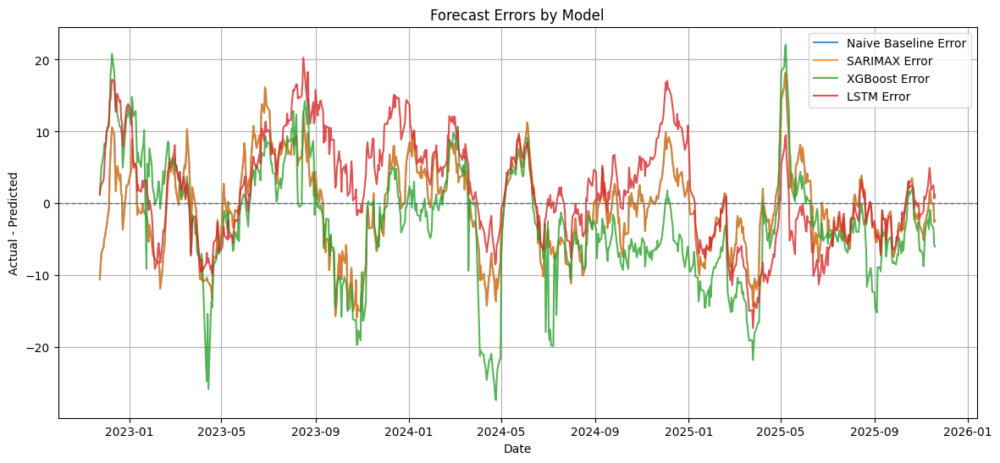

_Figure 10. Forecast errors by model._

The error plot shows long periods where errors remain on the same side of zero,
especially when the market changes direction. This means the models often lag
turning points. XGBoost has the largest negative error swings, while Naive and
SARIMAX are nearly identical.

## 4. Volatility Modelling Using GARCH

### 4.1 Return Series and Volatility Clustering

The GARCH section used daily log returns rather than prices.

| Return Statistic   |    Value |
| ------------------ | -------: |
| Observations       |    5,477 |
| Mean               |   0.0075 |
| Standard deviation |   2.5618 |
| Minimum            | -64.3699 |
| Maximum            |  41.2023 |

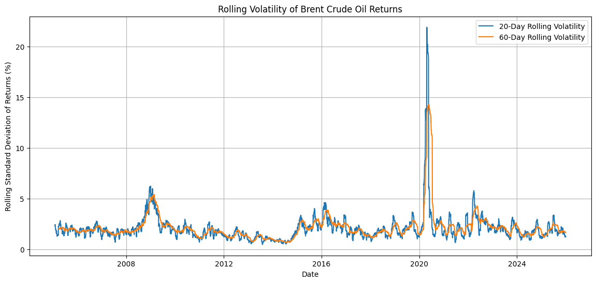

_Figure 11. Rolling volatility of Brent crude oil returns._

The rolling return-volatility plot shows strong volatility clustering.
Volatility rises sharply during crisis periods, especially 2008-2009 and 2020.
This supports GARCH modelling.

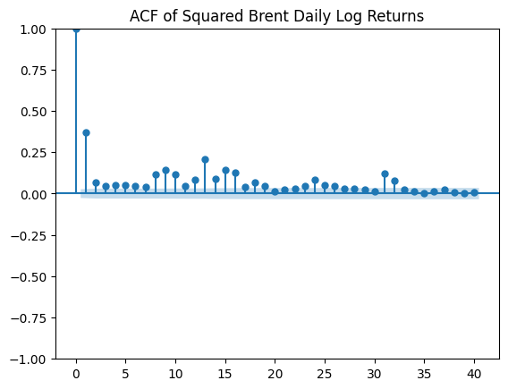

_Figure 12. ACF of squared Brent daily log returns._

The squared-return ACF shows positive autocorrelation, especially at early lags.
This is direct visual evidence that volatility is predictable from past
volatility, which is exactly the behaviour that GARCH models are designed to
capture.

### 4.2 GARCH Model and Parameter Interpretation

The rolling-volatility plot and squared-return ACF showed changing variance and
volatility clustering. Therefore, a GARCH model was appropriate for the Brent
return series.

A **GARCH(1,1)** specification with Student-t errors was selected because Brent returns contain heavy tails and extreme observations. The estimated parameters were:

| Parameter | Estimate | Interpretation |
| --- | ---: | --- |
| `omega` | 0.054424 | Baseline variance component. |
| `alpha[1]` | 0.085461 | Reaction of volatility to new shocks. |
| `beta[1]` | 0.907902 | Persistence of previous volatility. |
| `alpha + beta` | 0.993363 | Very high volatility persistence. |
| `nu` | 5.7402 | Heavy-tailed Student-t return distribution. |

The persistence value of **0.9934** is very close to one. This indicates that volatility shocks decay slowly, so major oil-market events can influence expected risk for many future days.

### 4.3 GARCH Forecast Evaluation

The GARCH forecast volatility was compared with absolute returns, squared
returns, and 20-day realized volatility.

| Metric                            |  Value | p-value |
| --------------------------------- | -----: | ------: |
| MAE vs absolute returns           | 1.1298 |         |
| RMSE vs absolute returns          | 1.3838 |         |
| MAE vs squared returns            | 4.2591 |         |
| Correlation with absolute returns | 0.1391 |  0.0346 |
| Correlation with squared returns  | 0.1338 |  0.0422 |

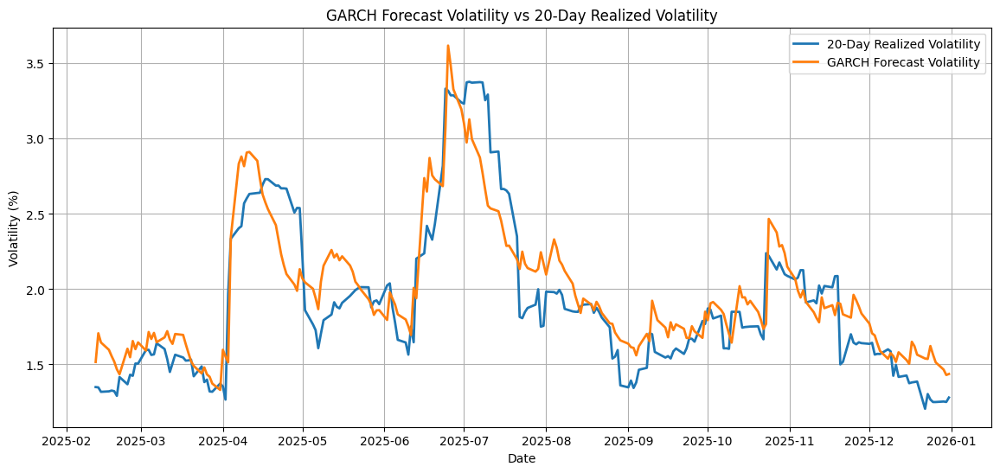

_Figure 13. GARCH forecast volatility vs 20-day realized volatility._

The GARCH forecast broadly follows the movement of realized volatility, but it
is smoother and sometimes leads or lags spikes. The correlation with actual
fluctuation proxies is statistically significant but weak. This means GARCH is
useful as a volatility-risk indicator, but it should not be treated as a perfect
day-by-day volatility forecast.

## 5. Comparative Insights and Practical Interpretation

### 5.1 Final Model Ranking

The final ranking selected the **Naive Baseline** as the best price forecasting
model. It achieved:

| Metric |   Value |
| ------ | ------: |
| MAE    |  5.0340 |
| RMSE   |  6.1968 |
| MAPE   | 6.4872% |
| sMAPE  | 6.4103% |

The worst price forecasting model was **XGBoost**, with RMSE **8.6574**.

This result is important because it shows that model complexity did not
automatically improve forecasting performance. Brent crude oil prices are highly
persistent, and a 30-business-day-ahead persistence forecast was difficult to
beat during the selected test period.

### 5.2 Model-Level Interpretation

**Naive Baseline:** The best-performing price model was the simplest. This does
not mean that the market is easy to forecast; it means that Brent prices were
persistent enough during the test period that current price was a strong
30-day-ahead benchmark.

**SARIMAX:** SARIMAX performed almost identically to the Naive baseline. Its
advantage is interpretability, but the selected model did not produce a
meaningful improvement over persistence.

**XGBoost:** XGBoost used many engineered features, but its feature-importance
plot shows strong reliance on recent price lags and rolling price statistics. It
performed worst on the test set, suggesting that the engineered features were
not enough to capture the market shocks and turning points in 2022-2025.

**LSTM:** LSTM performed better than XGBoost but worse than the Naive and
SARIMAX models. The actual-vs-predicted chart shows that LSTM produced smoother
forecasts, which helped reduce noise but also caused it to miss sharper turning
points. This behaviour is consistent with the course sequence-modelling
workflow: scaling, lookback-window construction, validation tuning, and
early-stopping reduce instability, but they do not guarantee better turning
point detection in a shock-driven commodity series.

**GARCH:** GARCH was useful for volatility rather than price level. The
Student-t GARCH(1,1) model captured volatility clustering and showed very high
volatility persistence. It should therefore be used as a risk indicator rather
than a complete price-forecasting solution.

### 5.3 Practical Use, Limitations, and Future Improvements

The price forecasts are most useful as short-term level benchmarks rather than
trading signals. The Naive and SARIMAX results show that price persistence is
strong, but the models still lag turning points during market regime changes.
This limits their standalone use for speculative decisions.

The volatility model is more useful for risk monitoring. The GARCH forecast can
help identify whether expected daily volatility is rising or falling, which is
relevant for hedging, scenario analysis, margin planning, and risk
communication. It should be interpreted as a risk indicator rather than a
precise day-by-day forecast.

The main limitation is that the analysis is mostly univariate. Historical Brent
prices contain useful information, but they cannot fully explain oil-market
shocks. A stronger operational model should include external drivers such as
inventory data, OPEC announcements, futures spreads, USD index movements,
interest rates, equity volatility, refinery activity, macroeconomic indicators,
and geopolitical risk measures. Model evaluation should also be repeated across
rolling test windows to check whether conclusions remain stable across different
market regimes.

The added ACF/PACF notebook cells should be used as final methodological checks
before submission. They do not change the dataset or the core model set, but
they make the SARIMAX order selection more transparent and more closely aligned
with the ML 25 teaching material.

The forecasts should also be used responsibly. Brent price and volatility
forecasts can influence trading, hedging, budgeting, and policy decisions, so
they should not be treated as standalone financial advice or automated decision
rules. Any operational use should include human review, scenario analysis,
uncertainty communication, and regular model monitoring.

## 6. Conclusions and Recommendations

This analysis used daily Brent crude oil prices from FRED/EIA to build a
complete time-series forecasting and volatility-modelling workflow. The dataset
contained strong regime changes, weak seasonality, major shocks, and clear
volatility clustering. Missing values were handled using business-day reindexing
and interpolation, while outliers were flagged and winsorized rather than
deleted.

For 30-business-day-ahead price forecasting, the **Naive Baseline** achieved the
best test performance with RMSE **6.1968** and MAPE **6.4872%**. SARIMAX was
almost identical, while LSTM and XGBoost were weaker. This shows that Brent
price persistence was very strong during the test period and that complex models
did not automatically outperform simple baselines.

For volatility modelling, the **GARCH(1,1)-StudentT** model was selected. It
captured volatility clustering effectively, with alpha + beta equal to
**0.9934**, indicating very persistent volatility shocks.

The final recommendation is to use the Naive or SARIMAX model as a transparent
benchmark for short-term Brent price levels and the GARCH model as a separate
risk-monitoring tool. Future improvements should add exogenous variables such as
OPEC decisions, inventory data, USD index, equity volatility, geopolitical risk
indicators, interest rates, and futures-market information, because a univariate
price history alone cannot fully explain crude oil shocks.

## References

- FRED.
  [Crude Oil Prices: Brent - Europe (DCOILBRENTEU)](https://fred.stlouisfed.org/series/DCOILBRENTEU).
- U.S. Energy Information Administration.
  [Europe Brent Spot Price FOB](https://www.eia.gov/dnav/pet/hist/rbrted.htm).
- ICE.
  [Brent: The global benchmark for navigating crude oil markets](https://www.ice.com/brent-crude).
- Ziolkowski, K. (2024).
  [Forecasting WTI & Brent Crude Oil Price Using LSTM, Prophet and XGBoost](https://www.springerprofessional.de/en/forecasting-wti-brent-crude-oil-price-using-lstm-prophet-and-xgb/27460198).
- Zhang, Y., & Lahmiri, S. (2025).
  [A Deep Learning-Based Ensemble System for Brent and WTI Crude Oil Price Analysis and Prediction](https://pubmed.ncbi.nlm.nih.gov/41294965/).
- Yilmaz, T., & Zehir, E. (2026).
  [Strategic Risk Based Forecasting of Brent Crude Oil Prices](https://pubmed.ncbi.nlm.nih.gov/42187954/).
- Zhao, Y., Hu, B., & Wang, S. (2024).
  [Prediction of Brent crude oil price based on LSTM model under the background of low-carbon transition](https://arxiv.org/abs/2409.12376).
- Alruqimi, M., & Di Persio, L. (2024).
  [Enhancing Multi-Step Brent Oil Price Forecasting with Ensemble Multi-Scenario Bi-GRU Networks](https://arxiv.org/abs/2407.11267).
- Chung, S. (2024).
  [Modelling and Forecasting Energy Market Volatility Using GARCH and Machine Learning Approach](https://arxiv.org/abs/2405.19849).
- Cohen, G. (2025).
  [A Comprehensive Study on Short-Term Oil Price Forecasting Using Econometric and Machine Learning Techniques](https://www.mdpi.com/2504-4990/7/4/127).
