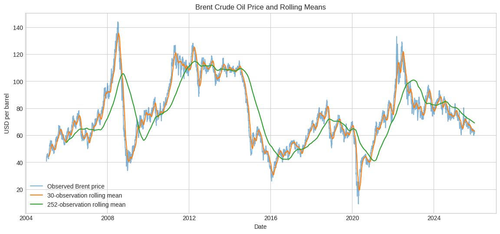
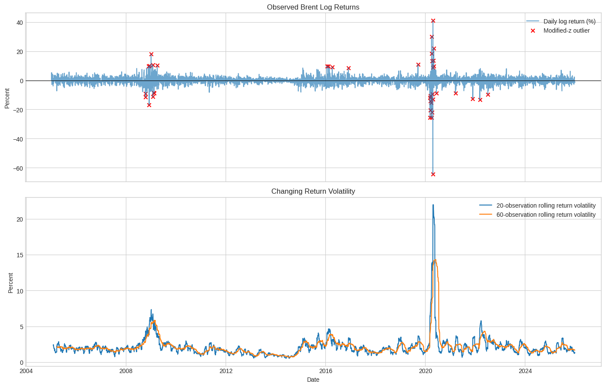
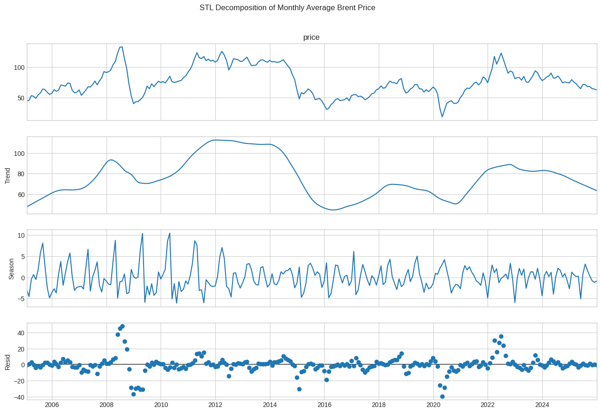
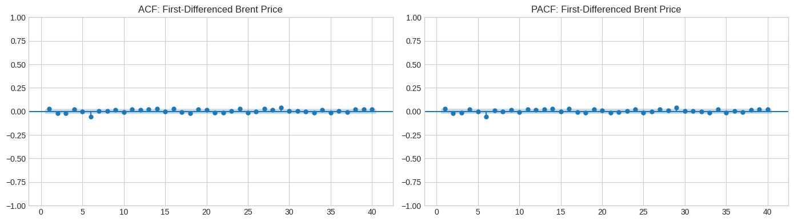
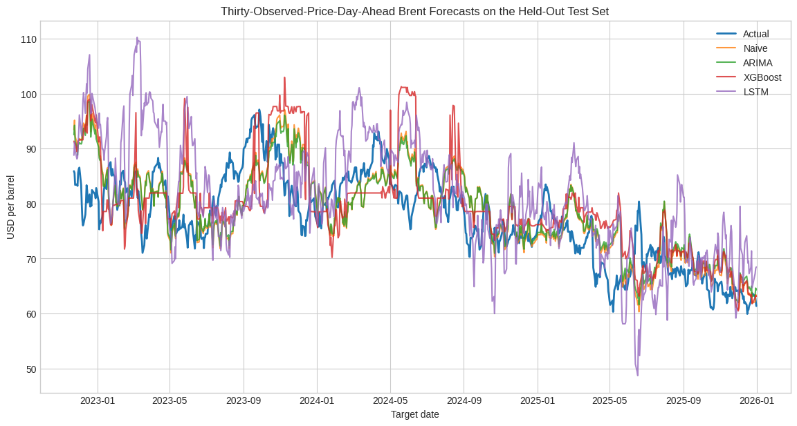
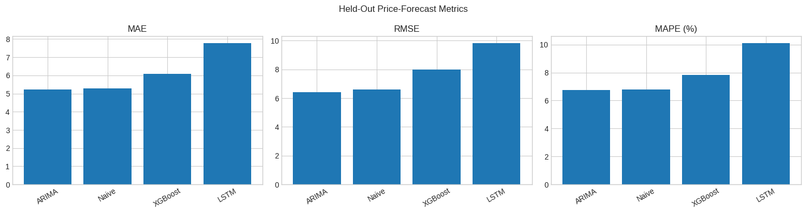
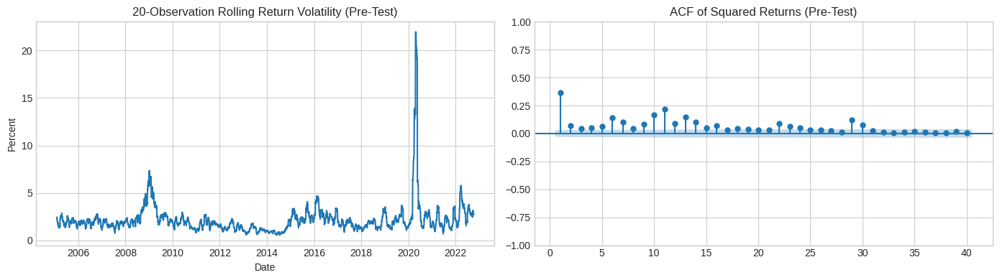
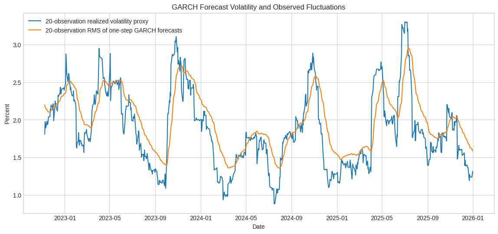

# Brent Crude Oil Price Forecasting and Volatility Analysis

## Abstract

This study examines the predictability of Brent crude oil prices and return volatility using a fixed sample of 5,315 observed prices from 4 January 2005 to 31 December 2025. Three models—ARIMA, XGBoost, and LSTM—forecast the price 30 observed price days ahead and are compared with a naive persistence benchmark. A Student-t GARCH(1,1) model separately forecasts one-observation-ahead return volatility. All model development preserves temporal order, uses target-date purging at split boundaries, and evaluates price models on the same 784 held-out forecast origins. ARIMA(2,0,0) records the lowest test RMSE at 6.419 USD per barrel, although its 2.57% improvement over persistence is modest. XGBoost and LSTM do not improve on the naive benchmark. The return series exhibits strong conditional heteroscedasticity, while GARCH estimates very persistent volatility dynamics (\(\alpha+\beta=0.9922\)). Its correlations with realized-return proxies are weak, however. The results support using these models as transparent planning and risk benchmarks rather than autonomous trading systems.

## 1. Study Design and Data

### 1.1 Data source and scope

The analysis uses the Federal Reserve Bank of St. Louis series **DCOILBRENTEU**, Europe Brent Spot Price FOB, whose original source is the U.S. Energy Information Administration (EIA). The series is quoted in U.S. dollars per barrel, published daily, and not seasonally adjusted. Brent is appropriate for this analysis because the sample contains long trends, changing market regimes, abrupt shocks, and volatility clustering. These properties permit both price forecasting and a separate examination of conditional return variance.

The fixed data window is 1 January 2005 to 31 December 2025. The first available price is 4 January 2005. The downloaded data are retained only after schema and date-coverage checks; the filtered data used in the executed notebook have SHA-256 hash `5b79068704c8b14cf8482ad3ab8dc5a53dee022731d408569960ebeba54cdda6`.

| Property | Executed value |
|---|---:|
| Observed date range | 2005-01-04 to 2025-12-31 |
| Business-weekday positions | 5,478 |
| Observed prices | 5,315 |
| Unavailable weekday prices | 163 |
| Duplicate dates after cleaning | 0 |
| Mean price | 75.692 USD/bbl |
| Standard deviation | 23.656 USD/bbl |
| Minimum | 9.120 USD/bbl |
| First quartile | 58.555 USD/bbl |
| Median | 72.560 USD/bbl |
| Third quartile | 91.980 USD/bbl |
| Maximum | 143.950 USD/bbl |

### 1.2 Forecasting targets

The price models estimate the direct 30-observed-price-day target

$$
y_t=P_{t+30},
$$

where \(P_t\) is the Brent spot price observed at forecast origin \(t\). An “observed price day” means the next row with a published FRED price; it is not an interpolated calendar or business day.

For volatility analysis, consecutive observed prices are converted to percentage log returns:

$$
r_t=100\left[\log(P_t)-\log(P_{t-1})\right].
$$

GARCH estimates the conditional variance and standard deviation of \(r_t\) one observed-price interval ahead. It is not included in the price-model ranking because volatility and price level are different targets.

### 1.3 Literature context and model rationale

Recent work shows that crude-oil forecasting results depend on the information set, forecast horizon, validation design, and market regime. Ziółkowski (2024) compares LSTM, Prophet, and XGBoost for WTI and Brent, motivating a common out-of-sample comparison. Jin and Xu (2024) study neural-network forecasts across several energy prices, but neural flexibility still requires careful configuration and validation. Jha et al. (2024) demonstrate the potential of classical machine learning with multivariate crude-oil information; the present univariate design cannot reproduce the benefit of those external predictors. Alruqimi and Di Persio (2024) emphasize the difficulty of multi-step Brent forecasting with recurrent networks and the sensitivity of deep models to design choices. Chung (2024), an explicitly identified preprint, compares GARCH-family and machine-learning approaches to energy-market volatility and highlights persistent but imperfectly forecastable variance dynamics.

These studies motivate a compact model set. ARIMA supplies an interpretable linear benchmark, XGBoost uses nonlinear combinations of causal temporal features, and LSTM represents nonlinear sequential dependence. A naive persistence forecast tests whether added complexity improves on the current price. GARCH addresses conditional volatility rather than price direction.

## 2. Exploratory Analysis and Preprocessing

### 2.1 Missing observations and extreme returns

The 163 unavailable weekday prices are audited but not interpolated or backfilled. Modelling consecutive published quotes avoids inventing price paths and prevents artificial smoothing of returns, which would be particularly damaging to GARCH estimation. This choice means that observation intervals can span different numbers of calendar days, an issue considered later as a limitation.

The executed notebook produces 5,314 percentage log returns. Modified z-scores based on the median absolute deviation flag 40 observations at \(|z|>5\). The largest displayed movements include -64.370% on 21 April 2020 and +41.202% on 22 April 2020. These observations coincide with genuine periods of market disruption, so they are retained. No global winsorisation is applied, and no full-sample outlier indicator is used as a predictor. Robust training-only scaling is used for the LSTM, while Student-t innovations accommodate heavy tails in GARCH.

### 2.2 Trend, seasonality, and irregular variation

The price and rolling-mean plot shows a non-constant level with long rises, falls, and abrupt changes. The 30-observation mean follows short-term movements, whereas the 252-observation mean highlights slower regime changes. Rolling return standard deviations vary sharply through time and show clusters of high and low volatility.

*Figure 1. Observed Brent price with short- and long-window rolling means, 2005–2025.*

*Figure 2. Percentage log returns with retained modified-z outliers and 20- and 60-observation rolling standard deviations.*

Robust STL decomposition is applied to monthly mean prices with an annual period of 12. Component scales provide a concise comparison:

*Figure 3. Robust STL decomposition of monthly average Brent prices with a 12-month seasonal period.*

| STL component | Standard deviation |
|---|---:|
| Trend | 18.994 |
| Seasonal | 2.936 |
| Residual | 10.251 |

Trend variation dominates, irregular variation remains substantial, and seasonal variation is comparatively weak. Calendar encodings are therefore retained as possible secondary predictors rather than treated as the principal source of predictability.

### 2.3 Temporal features

All predictors at origin \(t\) use information available no later than \(t\). After lag construction and target alignment, the supervised dataset contains 5,225 rows and 24 predictors. Forecast origins extend from 30 March 2005 to 17 November 2025; corresponding targets extend from 11 May 2005 to 31 December 2025.

The predictors comprise:

- current price and current log return;
- price lags at 1, 2, 5, 10, 20, 30, and 60 observations;
- return lags at 1, 2, 5, 10, and 20 observations;
- price rolling means over 5, 20, and 60 observations;
- return rolling standard deviations over 5, 20, and 60 observations; and
- sine and cosine encodings for month and day of year.

### 2.4 Stationarity and autocorrelation

The Augmented Dickey-Fuller (ADF) null hypothesis is that the series contains a unit root.

| Series | ADF statistic | p-value | Lags | Decision at 5% |
|---|---:|---:|---:|---|
| Price level | -2.5279 | 0.1088 | 6 | Fail to reject the unit-root null |
| First price difference | -31.3714 | <0.0001 | 5 | Reject the unit-root null |
| Log return (%) | -11.9581 | \(4.16\times10^{-22}\) | 32 | Reject the unit-root null |

The price level is not supported as stationary, while differences and returns are stationary by this test. The ACF and PACF of first differences are mostly close to zero, with only small isolated spikes, suggesting limited short-memory price-change predictability. The ADF result motivates including differenced ARIMA candidates, but model order is ultimately selected by chronological forecast validation rather than by a diagnostic test alone.

*Figure 4. ACF and PACF of the first-differenced price over 40 lags.*

## 3. Price-Forecasting Methodology

### 3.1 Temporal validation design

The outer split is chronological and purged by target date. A training label must occur before validation begins, and a validation label must occur before testing begins. The resulting gaps prevent a 30-step future target from crossing a split boundary.

| Split | Rows | Forecast-origin range | Latest target date |
|---|---:|---|---|
| Training | 3,627 | 2005-03-30 to 2019-07-29 | 2019-09-09 |
| Validation | 754 | 2019-09-10 to 2022-08-26 | 2022-10-11 |
| Test | 784 | 2022-10-12 to 2025-11-17 | 2025-12-31 |

All final price models are evaluated at the same 784 test origins and against the same target dates. Accuracy is measured using MAE and RMSE in USD per barrel and MAPE in percent. Since all observed Brent prices are positive, the MAPE denominator is well defined.

### 3.2 Naive benchmark

The persistence forecast sets \(\hat P_{t+30}=P_t\). It is a diagnostic benchmark rather than a substitute for a fitted model. A model that cannot improve on persistence has not demonstrated that its additional complexity is useful for this target and period.

### 3.3 ARIMA

ARIMA candidates use \(p\in\{0,1,2\}\), \(d\in\{0,1\}\), and \(q\in\{0,1\}\), with a constant trend. Each candidate is scored at its thirtieth forecast step over 30 evenly spaced validation origins. All 12 candidates fit successfully, and ARIMA(2,0,0) gives the lowest sampled validation RMSE of 10.776 USD per barrel. The statsmodels `SARIMAX` class is only the implementation; no exogenous variables or seasonal terms are used, so the model is reported as ARIMA.

The selected \(d=0\) order does not overturn the level-series ADF result. Selection optimized validation forecast error, and estimation relaxed the stationarity constraint. The fitted model should therefore be regarded as a forecast approximation that may behave like a near-unit-root autoregression, not as evidence that Brent prices follow a stable stationary level process. A fitted-root and residual-stability analysis would be needed for a stronger structural interpretation.

### 3.4 XGBoost

XGBoost is tuned with 12 randomized hyperparameter candidates and four expanding `TimeSeriesSplit` folds. Each fold uses a 30-row gap, and explicit assertions verify that its latest training target precedes the first validation origin. The selected parameters are:

| Hyperparameter | Selected value |
|---|---:|
| Number of trees | 150 |
| Maximum depth | 2 |
| Learning rate | 0.03 |
| Subsample | 0.85 |
| Column subsample | 1.00 |
| Minimum child weight | 1 |
| L1 regularisation | 0.10 |
| L2 regularisation | 1.00 |

The best purged cross-validation RMSE is 13.035 USD per barrel. After selection, the estimator is refitted on all eligible pre-test rows.

### 3.5 LSTM

The LSTM uses scaled sequences of temporal predictors. `RobustScaler` is fitted to features and `MinMaxScaler` to the target using eligible training data only. The architecture contains one LSTM layer, dropout, a 16-unit ReLU dense layer, and a one-unit output layer. Training uses Adam, mean-squared-error loss, chronological batches (`shuffle=False`), a maximum of 40 epochs, and early stopping with patience five.

Four compact configurations vary lookback, recurrent units, dropout, learning rate, and batch size. The selected validation configuration uses a 60-observation lookback, 32 LSTM units, dropout 0.10, learning rate 0.001, batch size 32, and 15 epochs. The chosen model and scalers are then rebuilt and fitted using eligible pre-test data only.

### 3.6 Reproducibility

Random seeds are fixed at 42 for Python, NumPy, TensorFlow, and XGBoost. The executed environment records pandas 2.2.2, NumPy 2.0.2, statsmodels 0.14.6, scikit-learn 1.6.1, XGBoost 3.3.0, TensorFlow 2.20.0, and arch 8.0.0. Full code, diagnostics, tuning tables, and plots are retained in the executed notebook.

## 4. Price-Forecasting Results

### 4.1 Model selection evidence

The selection procedures use different resampling designs, so their validation results document model development rather than a fair cross-model ranking. ARIMA uses 30 sampled rolling origins, XGBoost uses purged internal cross-validation followed by the full chronological validation block, and LSTM uses the chronological validation block.

| Model and selected configuration | Validation MAE | Validation RMSE | Validation MAPE |
|---|---:|---:|---:|
| ARIMA(2,0,0), 30 sampled origins | 8.737 | 10.776 | 18.33% |
| XGBoost, full validation block | 10.909 | 15.183 | 21.10% |
| LSTM, full validation block | 11.798 | 15.043 | 23.70% |

The validation period contains unusually large price movements visible around 2020 and 2022, whereas much of the test period is calmer. This difference plausibly contributes to lower test errors for every model, but it is an interpretation of the observed regimes rather than a causal finding.

### 4.2 Held-out comparison

| Rank | Model | MAE (USD/bbl) | RMSE (USD/bbl) | MAPE |
|---:|---|---:|---:|---:|
| 1 | ARIMA | 5.223 | 6.419 | 6.73% |
| 2 | Naive persistence | 5.288 | 6.588 | 6.79% |
| 3 | XGBoost | 6.090 | 7.985 | 7.83% |
| 4 | LSTM | 7.761 | 9.809 | 10.08% |

*Figure 5. Actual and 30-observed-price-day-ahead forecasts at the common held-out target dates.*

*Figure 6. Held-out MAE, RMSE, and MAPE comparison; lower values indicate better forecasts.*

ARIMA has the lowest point estimates for all three metrics. Its advantage over the naive benchmark is small: 1.24% for MAE, 2.57% for RMSE, and 0.85% for MAPE. XGBoost deteriorates relative to persistence by 15.15%, 21.20%, and 15.36%, respectively; the corresponding LSTM deteriorations are 46.75%, 48.88%, and 48.55%.

The aligned forecast plot shows that all models lag some turning points. ARIMA and persistence are close, XGBoost produces piecewise responses typical of tree ensembles, and LSTM frequently overshoots the held-out price. The three-panel metric chart confirms the table ranking. Model complexity therefore does not translate into better forecasting in this univariate setting.

The 30-step targets overlap heavily across adjacent origins, so the 784 forecast errors are serially dependent. No block-bootstrap or overlapping-horizon significance test is conducted. Consequently, ARIMA should be described as having the lowest observed error, not as materially or statistically superior to persistence.

## 5. Conditional Volatility Modelling

### 5.1 Evidence of conditional heteroscedasticity

The pre-test rolling standard deviation varies markedly, and the ACF of squared returns remains positive over several lags. Formal ARCH-LM results reinforce this visual evidence:

| Statistic | Value |
|---|---:|
| ARCH-LM | 970.433 |
| ARCH-LM p-value | \(7.85\times10^{-193}\) |
| F statistic | 61.648 |
| F-test p-value | \(1.69\times10^{-218}\) |

*Figure 7. Pre-test 20-observation rolling return volatility and ACF of squared returns.*

The null of no ARCH effects is decisively rejected. Conditional variance therefore changes with past shocks, making a GARCH specification appropriate.

### 5.2 GARCH(1,1)-Student-t estimates

For return innovation \(\epsilon_t\), the variance equation is

$$
\sigma_t^2=\omega+\alpha\epsilon_{t-1}^2+\beta\sigma_{t-1}^2.
$$

A constant-mean GARCH(1,1) with standardized Student-t innovations is fitted to 4,500 pre-test returns.

| Parameter | Estimate | Interpretation |
|---|---:|---|
| \(\mu\) | 0.0730 | Conditional mean return (%) |
| \(\omega\) | 0.059428 | Baseline variance component |
| \(\alpha\) | 0.085264 | Immediate response to a new squared shock |
| \(\beta\) | 0.906976 | Persistence of previous conditional variance |
| \(\alpha+\beta\) | 0.992239 | Overall volatility persistence |
| \(\nu\) | 6.101093 | Student-t degrees of freedom |

The large \(\beta\) estimate shows that past conditional variance dominates the next estimate. Since \(\alpha+\beta\) is close to one, shocks decay very slowly. The sum remains below one, giving a finite estimated long-run volatility of 2.767% per observed-price interval. The estimated \(\nu\) indicates substantially heavier tails than a Gaussian innovation model.

### 5.3 One-step forecast evaluation

The model produces expanding one-step forecasts over the post-12 October 2022 return period and refits parameters every 20 observations. True conditional volatility is latent, so absolute and squared returns are used only as noisy observable proxies.

| Comparison | Value | Unit |
|---|---:|---|
| MAE: forecast volatility vs. absolute return | 1.096 | Percentage points |
| RMSE: forecast volatility vs. absolute return | 1.331 | Percentage points |
| MAE: forecast variance vs. squared return | 4.012 | Squared percentage points |
| Correlation: forecast volatility vs. absolute return | 0.176 | Unitless |
| Correlation: forecast variance vs. squared return | 0.153 | Unitless |

*Figure 8. Twenty-observation realized-volatility proxy and RMS of expanding one-step GARCH forecasts.*

The smoothed 20-observation comparison follows broad rises and falls in the volatility regime but responds incompletely and sometimes late to sharp realized-return spikes. Both correlations are weak. GARCH captures persistence and supplies an interpretable conditional-risk signal, but these results do not demonstrate strong point-by-point forecast accuracy. No competing volatility forecast or QLIKE comparison is included, so relative volatility performance cannot be claimed.

## 6. Discussion and Critical Reflection

ARIMA is transparent and performs best in the held-out price comparison, but its advantage over persistence is marginal. Its validation-selected \(d=0\) order also requires caution given the non-stationary level diagnostic and relaxed stationarity constraint. XGBoost can model nonlinear interactions among lags and rolling statistics, but tree ensembles interpolate known price regimes more naturally than they extrapolate structural change. LSTM can represent nonlinear sequences, yet it is more computationally demanding and less interpretable; in this test period it also produces the largest errors. GARCH complements these models by estimating risk dynamics rather than price direction and should not be placed in the price-error ranking.

For operational planning, ARIMA and persistence provide simple level benchmarks. GARCH can indicate whether conditional risk is rising or falling and may support hedging context, scenario analysis, or risk communication. Neither result is sufficient for automated trading or a standalone financial decision. Point forecasts omit uncertainty, and abrupt changes driven by information outside the historical price path remain difficult to anticipate.

The analysis is deliberately univariate and therefore omits inventories, production policy, futures-curve information, exchange rates, macroeconomic conditions, financial-market stress, and geopolitical developments. Other limitations include unequal calendar duration between observed-price intervals, a single train-validation-test sequence, compact rather than exhaustive tuning grids, overlapping forecast errors, no formal comparison of the small ARIMA-naive difference, and a symmetric fixed-parameter GARCH specification. Absolute and squared returns are also imperfect proxies for latent variance.

Future work should prioritize rolling evaluation over multiple market regimes, carefully time-stamped exogenous variables, forecast intervals, and a formal dependence-aware comparison of price forecasts. Volatility work could compare GARCH with a transparent historical-volatility benchmark using an appropriate variance loss. Any practical deployment should include human review, uncertainty communication, data-quality controls, and regular monitoring for structural change. Results should not be represented as financial advice.

## 7. Conclusion

Brent prices over 2005–2025 exhibit strong trend and irregular variation, weak seasonality, non-stationary levels, extreme return shocks, and pronounced volatility clustering. ARIMA(2,0,0) records the lowest held-out price errors, but its improvement over naive persistence is too small to establish meaningful superiority without further testing. XGBoost and LSTM do not justify their additional complexity in this univariate test. Student-t GARCH(1,1) identifies heavy tails and highly persistent conditional variance, although its correspondence with realized-return proxies is weak. The combined evidence supports transparent forecast and risk benchmarks, accompanied by uncertainty and human judgement, rather than autonomous decision rules.

## References

Alruqimi, M., & Di Persio, L. (2024). Enhancing multi-step Brent oil price forecasting with ensemble multi-scenario Bi-GRU networks. *International Journal of Computational Intelligence Systems, 17*, Article 225. https://doi.org/10.1007/s44196-024-00640-3

Chung, S. (2024). *Modelling and forecasting energy market volatility using GARCH and machine learning approach* [Preprint]. arXiv. https://doi.org/10.48550/arXiv.2405.19849

Federal Reserve Bank of St. Louis. (2026). *Crude oil prices: Brent—Europe (DCOILBRENTEU)* [Data set; original source: U.S. Energy Information Administration]. https://fred.stlouisfed.org/series/DCOILBRENTEU

Jha, N., Tanneru, H. K., Palla, S., & Mafat, I. H. (2024). Multivariate analysis and forecasting of the crude oil prices: Part I—Classical machine learning approaches. *Energy, 296*, 131185. https://doi.org/10.1016/j.energy.2024.131185

Jin, B., & Xu, X. (2024). Price forecasting through neural networks for crude oil, heating oil, and natural gas. *Measurement: Energy*, 100001. https://doi.org/10.1016/j.meaene.2024.100001

U.S. Energy Information Administration. (2026). *Europe Brent Spot Price FOB (dollars per barrel)*. https://www.eia.gov/dnav/pet/hist/rbrted.htm

Ziółkowski, K. (2024). Forecasting WTI & Brent crude oil price using LSTM, Prophet and XGBoost—Comparative analysis. In N. T. Nguyen et al. (Eds.), *Recent challenges in intelligent information and database systems* (CCIS Vol. 2145, pp. 171–181). Springer. https://doi.org/10.1007/978-981-97-5934-7_15
