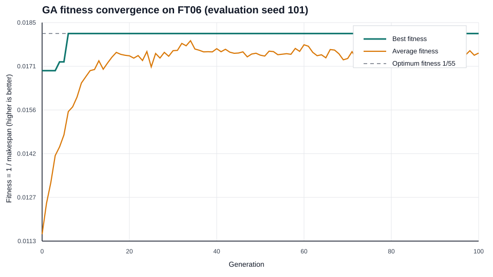
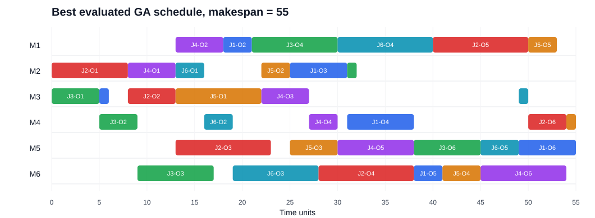
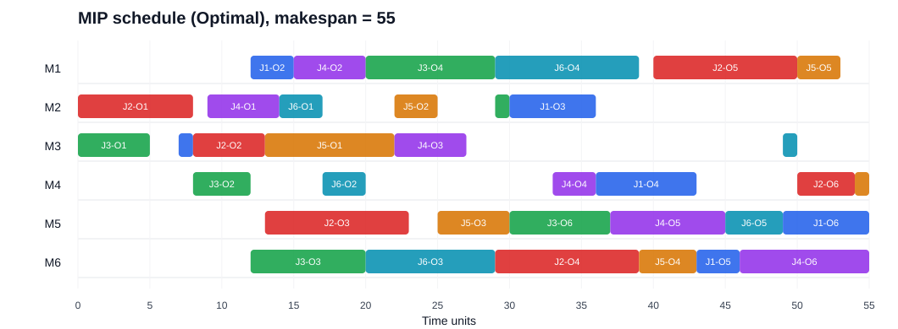

# Job-Shop Scheduling with a Genetic Algorithm and Mixed Integer Programming

## 1. Problem Definition and Literature Review (15%)

### 1.1 Prescriptive decision and objective

Job-shop scheduling is a prescriptive analytics problem: given jobs, machines, processing times, and operating constraints, the decision is **what processing sequence should be used**. This matches the course framing of optimization as recommending actions under constraints and of genetic algorithms (GAs) as metaheuristics for complex scheduling problems (ML 25, *Prescriptive Analytics*, Session 7 & 8, pp. 1, 5, 19–20).

This analysis uses the Fisher–Thompson FT06 benchmark as a controlled proxy for a manufacturing job shop. Six jobs must each complete six ordered operations on six machines. An operation cannot be interrupted, every job must follow its specified route, and a machine can process only one operation at a time. The objective is to minimize the makespan, the completion time of the final operation:

$$
\min C_{\max}.
$$

Reducing makespan improves throughput and shortens the time required to finish the production batch. FT06 is not data from a particular factory; it is a standard benchmark that isolates the sequencing decision before real-world additions such as due dates, breakdowns, and setup times.

### 1.2 Mathematical formulation

The model is presented in the course-taught order of decision variables, objective, constraints, and domains. Let $\mathcal O$ be the set of operations, $\mathcal P$ the set of consecutive-operation pairs belonging to the same job, and $\mathcal Q$ the set of unordered pairs of operations requiring the same machine. For operation $a\in\mathcal O$, $p_a$ is its processing time and $\mu_a$ its machine. The scheduling horizon is $H=197$, the sum of all processing times.

Decision variables are:

- $S_a\geq0$: start time of operation $a$;
- $C_a\geq0$: completion time of operation $a$;
- $C_{\max}\geq0$: makespan;
- $x_{ab}\in\{0,1\}$ for $\{a,b\}\in\mathcal Q$: 1 when $a$ is scheduled before $b$, and 0 otherwise.

The objective is:

$$
\min C_{\max}.
$$

Completion-time **equality constraints** are:

$$
C_a=S_a+p_a,\qquad a\in\mathcal O.
$$

Job-precedence **inequality constraints** are:

$$
C_a\leq S_b,\qquad (a,b)\in\mathcal P.
$$

For each same-machine pair $\{a,b\}\in\mathcal Q$, the binary variable activates one of two non-overlap inequalities:

$$
C_a\leq S_b+H(1-x_{ab}),
$$

$$
C_b\leq S_a+Hx_{ab}.
$$

The makespan covers every operation:

$$
C_a\leq C_{\max},\qquad a\in\mathcal O.
$$

Together with $S_a,C_a,C_{\max}\geq0$ and $x_{ab}\in\{0,1\}$, these constraints define a feasible job-shop schedule. Machine assignments are fixed benchmark parameters, so separate assignment variables are unnecessary.

### 1.3 Literature review and method selection

| Study | Contribution and relevance |
| --- | --- |
| Fisher and Thompson (1963) | Introduced influential job-shop test problems and probabilistic combinations of scheduling rules; FT06 originates from this benchmark family. |
| Garey, Johnson, and Sethi (1976) | Established the computational difficulty of job-shop makespan scheduling, motivating non-enumerative methods. |
| Adams, Balas, and Zawack (1988) | Developed the shifting-bottleneck heuristic, showing the value of problem-specific scheduling search. |
| Cheng, Gen, and Tsujimura (1996) | Reviewed GA representations for job-shop scheduling and emphasized that representation and operators must preserve meaningful schedules. |
| Gonçalves, Mendes, and Resende (2005) | Combined random-key GA search, schedule generation, and local search, demonstrating the strength of scheduling-specific hybrid GAs. |
| Ku and Beck (2016) | Compared four MIP formulations and found modern MIP effective on moderate instances, while also documenting formulation-dependent scalability. |
| Cebi, Atac, and Sahingoz (2020) | Reviewed exact, heuristic, and metaheuristic JSSP methods, including GA and mathematical programming. |

GA and MIP are selected because they provide complementary evidence. GA follows the course evolutionary workflow—population, chromosome, fitness, selection, crossover, mutation, and repeated generations—but can converge prematurely and cannot prove optimality. MIP expresses the objective and hard constraints directly and can prove optimality when the solver terminates with an optimal status. Comparing both on identical FT06 data separates solution quality from proof of solution quality.

## 2. Data Preparation and Problem Analysis (10%)

### 2.1 Dataset and representations

FT06 was obtained from the OR-Library benchmark collection (Beasley, 1990). It has six jobs, six machines, 36 operations, and a known optimal makespan of 55. The Python implementation stores the data in the two representations required by both methods.

Processing-time matrix $P$:

| Job | O1 | O2 | O3 | O4 | O5 | O6 |
| --- | ---: | ---: | ---: | ---: | ---: | ---: |
| J1 | 1 | 3 | 6 | 7 | 3 | 6 |
| J2 | 8 | 5 | 10 | 10 | 10 | 4 |
| J3 | 5 | 4 | 8 | 9 | 1 | 7 |
| J4 | 5 | 5 | 5 | 3 | 8 | 9 |
| J5 | 9 | 3 | 5 | 4 | 3 | 1 |
| J6 | 3 | 3 | 9 | 10 | 4 | 1 |

Machine-route matrix $M$:

| Job | O1 | O2 | O3 | O4 | O5 | O6 |
| --- | ---: | ---: | ---: | ---: | ---: | ---: |
| J1 | M3 | M1 | M2 | M4 | M6 | M5 |
| J2 | M2 | M3 | M5 | M6 | M1 | M4 |
| J3 | M3 | M4 | M6 | M1 | M2 | M5 |
| J4 | M2 | M1 | M3 | M4 | M5 | M6 |
| J5 | M3 | M2 | M5 | M6 | M1 | M4 |
| J6 | M2 | M4 | M6 | M1 | M5 | M3 |

Preprocessing converts the one-based report labels to zero-based Python indices and creates one record per operation. No imputation, scaling, or statistical transformation is appropriate because the benchmark parameters are complete deterministic integers. The same matrices supply GA decoding and MIP coefficients, ensuring a like-for-like comparison.

Assumptions are deterministic processing times, non-preemptive operations, continuous machine availability from time zero, and one operation per machine at a time. Setup times, due dates, staff limits, maintenance, and machine breakdowns are outside the selected classical JSSP.

### 2.2 Lower bound and complexity

The longest job requires 47 time units and the largest machine workload is 43, giving the simple lower bound

$$
C_{\max}\geq\max(47,43)=47.
$$

An operation-based chromosome has 36 positions containing six copies of each job. Its number of distinct sequences is

$$
\frac{36!}{(6!)^6}\approx2.67\times10^{24}.
$$

Many sequences decode to the same schedule, but this figure still shows why exhaustive enumeration is unsuitable. The known optimum of 55 is used only for reporting and benchmark comparison; it never guides parent selection, crossover, mutation, decoding, hyperparameter selection, or stopping.

## 3. Genetic Algorithm Design, Tuning, and Results (30%)

### 3.1 Complete GA design

The chromosome is a length-36 list in which each job identifier occurs six times. The $k$th appearance of a job schedules that job's $k$th operation. Reading genes from left to right, the decoder starts each operation at

$$
S_a=\max\{\text{job-ready time},\text{machine-ready time}\}.
$$

Consequently, job precedence and machine capacity are satisfied by construction. This is a domain-specific refinement of the course scheduling example: the classroom fitness penalizes infeasible allocations, whereas this decoder produces only feasible schedules and can use makespan directly.

| GA component | Implemented design |
| --- | --- |
| Population initialization | Random shuffles of six copies of each job; a local seeded random generator makes every run reproducible. |
| Fitness | $f(z)=1/C_{\max}(z)$; implementation ranks the equivalent makespan directly, with lower values preferred. |
| Selection | Tournament selection, tournament size 3. |
| Crossover | Job Order Crossover (JOX), which preserves six occurrences of every job. |
| Mutation | Swap mutation, which exchanges two genes and preserves job counts while maintaining diversity. |
| Elitism | Best four chromosomes copied unchanged to the next generation. |
| Stopping criterion | The configured maximum number of generations; the benchmark optimum does not stop the search. |
| Best-solution tracking | Best-so-far chromosome, makespan, fitness, schedule, and first generation matching 55. |

This sequence follows the taught GA workflow in *LP & LP with GA.ipynb*. JOX and swap mutation replace the notebook's generic one-point and random-reset operators because those operators could invalidate the repeated-job chromosome.

### 3.2 Hyperparameter tuning

The course tuning material distinguishes a search space, validation metric, reproducible search, and held-out evaluation. A full $3^4=81$ grid would be unnecessarily expensive, so 12 configurations were sampled reproducibly from that grid using search seed 2025. All values of every required hyperparameter were covered:

| Hyperparameter | Values searched |
| --- | --- |
| Population size | 50, 100, 150 |
| Crossover probability | 0.80, 0.90, 0.95 |
| Mutation probability | 0.10, 0.20, 0.30 |
| Maximum generations | 100, 300, 500 |

Each candidate was run on tuning seeds 11, 29, and 47. Selection minimized mean makespan, then worst makespan; remaining ties used makespan standard deviation and the nominal population-by-generation budget. The known optimum and hit rate were descriptive evaluation measures, not selection targets. Runtime was recorded but not used as the first criterion because wall-clock time varies with the execution environment. The complete 36-run tuning stage took approximately 54.4 seconds and was a one-off model-selection cost.

| ID | Pop. | $p_c$ | $p_m$ | Gen. | Mean | Worst | Hit rate | Selected |
| ---: | ---: | ---: | ---: | ---: | ---: | ---: | ---: | --- |
| 1 | 150 | 0.90 | 0.30 | 500 | 55.67 | 57 | 66.7% | No |
| 2 | 50 | 0.90 | 0.10 | 300 | 57.33 | 59 | 33.3% | No |
| 3 | 150 | 0.80 | 0.30 | 300 | 57.67 | 59 | 33.3% | No |
| 4 | 50 | 0.95 | 0.20 | 300 | 57.67 | 58 | 0.0% | No |
| 5 | 150 | 0.90 | 0.20 | 300 | 55.00 | 55 | 100.0% | No |
| 6 | 50 | 0.80 | 0.10 | 100 | 58.33 | 59 | 0.0% | No |
| 7 | 100 | 0.95 | 0.10 | 500 | 57.00 | 59 | 33.3% | No |
| 8 | 100 | 0.95 | 0.20 | 100 | 55.00 | 55 | 100.0% | **Yes** |
| 9 | 150 | 0.95 | 0.10 | 100 | 57.33 | 59 | 33.3% | No |
| 10 | 100 | 0.80 | 0.10 | 500 | 56.00 | 58 | 66.7% | No |
| 11 | 50 | 0.80 | 0.30 | 500 | 58.67 | 59 | 0.0% | No |
| 12 | 150 | 0.95 | 0.10 | 300 | 57.33 | 59 | 33.3% | No |

Candidates 5 and 8 tied on all solution-quality criteria. Candidate 8 was selected because its nominal evaluation budget, $100\times100$, was lower than candidate 5's $150\times300$. Elitism and tournament size were fixed design choices, not tuned parameters.

### 3.3 Independent evaluation, convergence, and best solution

The selected configuration was then evaluated on five separate seeds that were not used for selection.

| Measure | Evaluation result |
| --- | ---: |
| Best makespan | 55 |
| Mean makespan | 56.00 |
| Across-run standard deviation of best makespan | 1.265 |
| Worst makespan | 58 |
| Runs matching the optimum | 3 of 5 (60%) |
| Mean runtime per run | 0.508 seconds |
| Generations per run | 100 |

The best evaluated run was seed 101. Its initial best makespan was 59, it first reached 55 at generation 6, and it retained 55 through generation 100 because of elitism. The final population mean was 57.45. The plot therefore shows both rapid best-solution improvement and continued population variation.

The best-run schedule below contains all 36 operations and was independently checked for correct durations and routes, non-negative starts, job precedence, machine non-overlap, and agreement between the schedule makespan and reported objective.

The best GA run has a benchmark gap of

$$
\frac{55-55}{55}\times100=0\%.
$$

This establishes that GA **found** an optimal schedule in that run; it does not mean GA proved optimality or reached 55 reliably. The 60% hit rate is the relevant evidence of stochastic variability outside the tuning seeds.

### 3.4 Computational efficiency and scalability

Decoding scans each of the $nm$ genes once, so one evaluation is $O(nm)$. Ignoring operator overhead, the selected run performs at most

$$
100\text{ individuals}\times100\text{ generations}\times36\text{ operations}
=360{,}000
$$

operation placements, plus the initial population. Evaluations are independent and could be parallelized. For larger instances, however, the chromosome length, population required for diversity, and generations needed for reliable search are likely to increase. GA can retain practical time limits by controlling these budgets, but it provides no optimality bound and remains sensitive to representation, operators, and seed.

## 4. Mixed Integer Programming Implementation and Results (25%)

### 4.1 PuLP implementation

The mathematical model in Section 1.2 was implemented in PuLP 3.3.2 and solved with CBC using a 120-second limit. The code creates completion-time equalities, job-precedence inequalities, binary same-machine disjunctions, and makespan inequalities directly. A result is labelled optimal only when CBC returns `Optimal` and an independent schedule validator passes.

| Model component | Count |
| --- | ---: |
| Start-time variables $S_a$ | 36 |
| Completion-time variables $C_a$ | 36 |
| Binary sequencing variables $x_{ab}$ | 90 |
| Makespan variable | 1 |
| **Total variables** | **163** |
| Completion equalities | 36 |
| Job-precedence inequalities | 30 |
| Machine non-overlap inequalities | 180 |
| Makespan inequalities | 36 |
| **Total constraints** | **282** |

The 90 binaries arise because each of six machines processes six operations: $6\binom{6}{2}=90$. The valid Big-M horizon is $H=197$.

### 4.2 Objective, feasibility, computation time, and best solution

| Measure | MIP result |
| --- | ---: |
| CBC status | Optimal |
| Objective / makespan | 55 |
| Gap from known optimum | 0.00% |
| Runtime | 2.153 seconds |
| Operations validated | 36 |
| Schedule validation | Passed |

Validation confirmed the equality definitions, all job precedences, non-negative times, correct routes and durations, absence of machine overlaps, and a calculated makespan of 55. Because CBC returned `Optimal`, MIP proves that no lower objective is feasible for this formulation; agreement with the published FT06 optimum provides an additional benchmark check.

Runtimes are local observations from Python 3.13.5 on the stated execution environment and should not be generalized as hardware-independent performance.

### 4.3 MIP scalability

If every one of $n$ jobs visits each of $m$ machines once, pairwise sequencing requires

$$
m\binom{n}{2}=O(mn^2)
$$

binary variables and twice as many disjunctive inequalities. The branch-and-bound search can grow much faster than this model-size expression suggests. Big-M constraints may also give weak linear relaxations. Thus the FT06 result demonstrates exactness on a small instance, not guaranteed fast performance on large job shops. Larger-scale claims here are theoretical; no larger benchmark was executed.

## 5. Comparative Analysis and Critical Reflection (20%)

| Required comparison | Genetic Algorithm | Mixed Integer Programming |
| --- | --- | --- |
| Solution quality and objective | Best run 55; mean 56; worst 58; 60% of evaluation runs reached 55 | Objective 55 in one deterministic solve |
| Optimality evidence | Empirical 0% benchmark gap for the best run; no proof | CBC status `Optimal` proves optimality for the model |
| Computational performance | Mean 0.508 s per held-out run; one-off 36-run tuning cost 54.4 s | 2.153 s for model construction and solve |
| Scalability | Evaluation budget is controllable and parallelizable, but reliable quality may require larger populations and more generations | Binary pairs and solver search grow rapidly; proving optimality can become difficult |
| Complex constraints | Decoder can be extended and soft rules can enter fitness penalties, but feasibility logic must be designed and tested | Hard rules are explicit and auditable, but each added constraint enlarges or complicates the model |
| Flexibility and real-world applicability | Well suited to changing objectives, soft preferences, and time-limited search | Well suited when constraints are stable and a proof or bound is important |

On FT06, MIP is preferable when the decision-maker requires a proven optimum and the model remains tractable. GA is preferable when instance size or operational complexity makes exact proof too costly and a high-quality feasible schedule within a controlled time is sufficient. A selected-configuration GA run was faster here, but its one-off tuning stage was slower than the MIP solve. Neither observation establishes general superiority: FT06 is small, CBC and Python have different implementation overheads, and GA displayed seed-dependent quality.

The experiment has four important limitations. First, FT06 is a deterministic benchmark proxy rather than a live factory dataset. Second, only one small instance was solved, so scalability conclusions are reasoned rather than empirical. Third, three tuning seeds and five evaluation seeds provide a transparent but limited robustness sample. Fourth, the GA decoder and operators represent one design; another representation or local search could change the comparison.

Possible improvements required by the analysis are:

1. **Hybrid GA–MIP:** use GA to supply a strong feasible schedule as a MIP warm start, then let MIP improve it or certify a gap.
2. **Parallel optimization:** evaluate GA chromosomes or independent seeds concurrently; MIP could also use solver parallelism where available.
3. **Other metaheuristics and stronger models:** compare tabu search or simulated annealing with GA, and test tighter pair-specific Big-M values or valid inequalities for MIP.

In conclusion, both implementations returned a feasible schedule with makespan 55, but the evidence differs: GA found that value in three of five independent runs, whereas MIP proved it optimal. For this small benchmark MIP gives the stronger assurance; for larger or more changeable scheduling problems, GA or a hybrid approach may offer the more practical balance between time, flexibility, and solution quality.

## References

- Adams, J., Balas, E., and Zawack, D. (1988). The shifting bottleneck procedure for job shop scheduling. *Management Science*, 34(3), 391–401. https://doi.org/10.1287/mnsc.34.3.391
- Beasley, J. E. (1990). OR-Library: Distributing test problems by electronic mail. *Journal of the Operational Research Society*, 41(11), 1069–1072. https://doi.org/10.1057/jors.1990.166
- Cebi, C., Atac, E., and Sahingoz, O. K. (2020). Job Shop Scheduling Problem and Solution Algorithms: A Review. *2020 11th International Conference on Computing, Communication and Networking Technologies*, 1–7. https://doi.org/10.1109/ICCCNT49239.2020.9225581
- Cheng, R., Gen, M., and Tsujimura, Y. (1996). A tutorial survey of job-shop scheduling problems using genetic algorithms—I. Representation. *Computers & Industrial Engineering*, 30(4), 983–997. https://doi.org/10.1016/0360-8352(96)00047-2
- Fisher, H., and Thompson, G. L. (1963). Probabilistic learning combinations of local job-shop scheduling rules. In J. F. Muth and G. L. Thompson (Eds.), *Industrial Scheduling* (pp. 225–251). Prentice-Hall.
- Garey, M. R., Johnson, D. S., and Sethi, R. (1976). The complexity of flowshop and jobshop scheduling. *Mathematics of Operations Research*, 1(2), 117–129. https://doi.org/10.1287/moor.1.2.117
- Gonçalves, J. F., Mendes, J. J. M., and Resende, M. G. C. (2005). A hybrid genetic algorithm for the job shop scheduling problem. *European Journal of Operational Research*, 167(1), 77–95. https://doi.org/10.1016/j.ejor.2004.03.012
- Ku, W.-Y., and Beck, J. C. (2016). Mixed Integer Programming models for job shop scheduling: A computational analysis. *Computers & Operations Research*, 73, 165–173. https://doi.org/10.1016/j.cor.2016.04.006

### ML 25 course materials used for method alignment

- *Prescriptive Analytics*, Session 7 & 8: optimization, metaheuristics, GA vocabulary, and scheduling representation.
- *LP & LP with GA.ipynb*, Session 7 & 8: exact-versus-GA workflow, tournament selection, convergence, and premature-convergence discussion.
- *Hyperparameter tuning*, Sessions 3 & 4 / 9 & 10: grid search, random search, validation metrics, reproducibility, and evaluation cost.
- *Lec 1 Linear Programming* and *Lec 2 Liner Programming*, Sessions 3 & 4: decision variables, objective, equality and inequality constraints, feasibility, and domains.
